# rLLM SDK 完整中文指南

> 本文档整合自：`docs/core-concepts/sdk.md`、`docs/examples/sdk_math.md`、`docs/examples/sdk_langgraph_rag.md`、`rllm/sdk/README.md` 及相关源码注释。

---

## 目录

1. [为什么需要 SDK？](#1-为什么需要-sdk)
2. [核心思路：拦截 LLM 调用而非改造 Agent](#2-核心思路拦截-llm-调用而非改造-agent)
3. [系统架构](#3-系统架构)
4. [快速安装与配置](#4-快速安装与配置)
5. [核心概念](#5-核心概念)
   - [Session（会话）](#51-session会话)
   - [Trace（轨迹记录）](#52-trace轨迹记录)
   - [Step（步骤）与 Trajectory（轨迹）](#53-step步骤与-trajectory轨迹)
6. [API 参考](#6-api-参考)
   - [获取客户端](#61-获取客户端)
   - [Session 上下文管理器](#62-session-上下文管理器)
   - [@trajectory 装饰器](#63-trajectory-装饰器)
   - [数据模型](#64-数据模型)
7. [教程一：训练数学解题 Agent（入门）](#7-教程一训练数学解题-agent入门)
8. [教程二：训练 LangGraph RAG Agent（进阶）](#8-教程二训练-langgraph-rag-agent进阶)
9. [进阶：细粒度 Session 控制](#9-进阶细粒度-session-控制)
10. [Session 后端：ContextVar vs OpenTelemetry](#10-session-后端contextvar-vs-opentelemetry)
11. [SDK 内部架构与目录结构](#11-sdk-内部架构与目录结构)
12. [设计原则](#12-设计原则)
13. [参考资料](#13-参考资料)

---

## 1. 为什么需要 SDK？

现代 RL 训练框架通常要求 Agent 采用固定格式——简单的消息列表循环加 ReAct 风格的环境交互。但现实中的先进 Agent 架构已远超这一范式：

- **Deep Research agents**：主 Agent 下发任务给多个子 Agent
- **LangGraph**：支持规划、分支和任务委托的复杂工作流
- **Multi-agent systems**：多个具有不同角色的 LLM 协同工作

这造成了一个根本性矛盾：**可训练的 ≠ 实际好用的**。

传统方法需要把 Agent 重写成训练框架要求的格式，代价是：

1. **代码重复**：训练版本和推理版本需要各维护一套
2. **细微 Bug**：训练与生产行为可能产生差异
3. **架构受限**：只有简单 Agent 模式才能被支持

---

## 2. 核心思路：拦截 LLM 调用而非改造 Agent

rLLM SDK 的解决方案是：**不限制你怎么构建 Agent，而是拦截 LLM 调用本身**。

✅ **兼容任意 Agent 框架** — LangChain、LangGraph、AutoGen 或纯 Python 代码
✅ **训练时无需改代码** — Agent 按原来的方式运行
✅ **训练与推理完全对齐** — 模型在两种模式下看到的内容完全一致

### 关键技术难点：重分词（Retokenization）不匹配

Agent RL 训练的核心挑战是**重分词不匹配**问题。当你：

1. 用模型 A 生成文本
2. 对文本重新分词以用于训练

可能因分词器的边界处理不同，得到不一样的 token 序列，导致训练数据 off-policy，从而使训练不稳定。

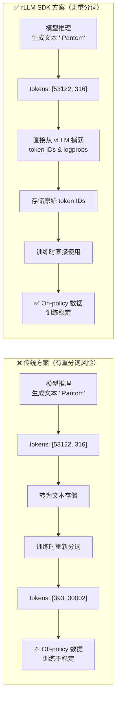

**SDK 的解法**：**直接从推理服务器（vLLM）捕获 token ID**，存储下来，直接用于训练。永远不会发生重分词。

---

## 3. 系统架构

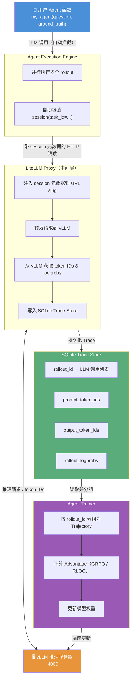

### 数据流说明

| 阶段 | 描述 |
|------|------|
| **Rollout 阶段** | Agent Execution Engine 并行执行你的 Agent 函数，函数通过 SDK 客户端发起 LLM 调用 |
| **捕获阶段** | 基于 LiteLLM 的代理拦截调用，注入元数据，从 vLLM 获取 token IDs 和 logprobs，写入 SQLite |
| **收集阶段** | Agent Trainer 从 SQLite 读取 LLM 调用，按 `rollout_id` 分组为 `Trajectory` 对象 |
| **训练阶段** | Trainer 利用 tokenized 数据计算优势函数，更新模型权重 |

---

## 4. 快速安装与配置

SDK 内置于 `rllm` 包，无需单独安装：

```python
from rllm.sdk import session, get_chat_client, trajectory
```

如需 OpenTelemetry 分布式追踪支持（可选），安装扩展：

```bash
pip install rllm[otel]
```

### SDK 配置文件

SDK 的后端选型通过 `rllm/sdk/config.yaml` 配置：

```yaml
# RLLM SDK Configuration
# Session 后端：contextvar（默认）或 opentelemetry
session_backend: contextvar
# session_backend: opentelemetry
```

---

## 5. 核心概念

下图展示了核心数据模型之间的层次关系：

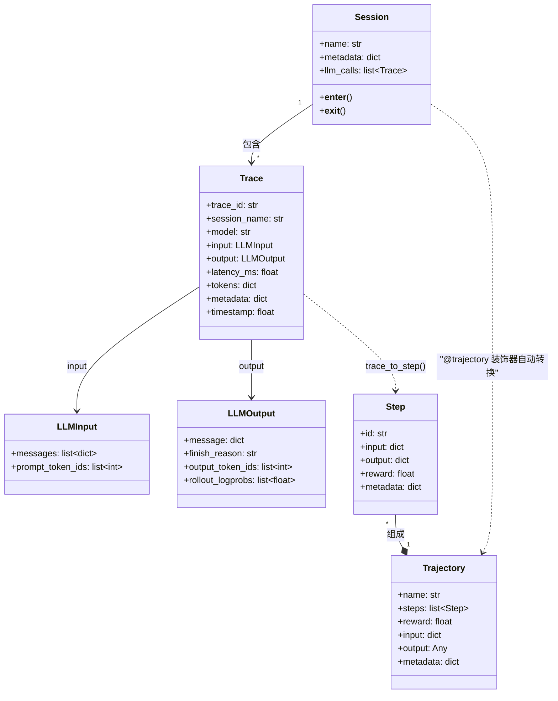

### 5.1 Session（会话）

**Session** 是对一次任务或 rollout 中所有 LLM 调用的上下文分组容器。Session 内的每次 LLM 调用都会产生一条 **Trace**，记录完整的 token IDs（prompt 和 completion）、log probabilities、原始消息以及元数据。

在大多数场景下，`AgentTrainer` 会自动管理 Session，你不需要手动创建。引擎内部实际上是这样调用你的函数的：

```python
# AgentTrainer 内部实现（自动包装）
with session(task_id=task["uid"]):
    reward = await my_agent(**task)
```

你可以免费获得 Session 的所有好处，而无需写任何 Session 代码。

#### Session 的嵌套与元数据继承

嵌套 Session 会自动合并元数据：

```python
from rllm.sdk import session

with session(experiment="v1"):
    with session(task="math", difficulty="hard"):
        # 此调用会获得合并后的元数据：
        # {experiment: "v1", task: "math", difficulty: "hard"}
        client.chat.completions.create(...)
```

### 5.2 Trace（轨迹记录）

**Trace** 是单次 LLM 调用的完整记录，数据结构如下（来自 `rllm/sdk/protocol.py`）：

```python
class Trace(BaseModel):
    trace_id: str           # e.g., "tr_abc123def456"
    session_name: str       # 格式："task_id:rollout_idx:retry_attempt"
    name: str               # e.g., "proxy/gpt-4"
    model: str              # e.g., "gpt-4", "Qwen/Qwen3-4B"
    input: LLMInput         # 包含 messages 和 prompt_token_ids
    output: LLMOutput       # 包含 message、finish_reason、output_token_ids、rollout_logprobs
    latency_ms: float       # 调用延迟（毫秒）
    tokens: dict[str, int]  # prompt/completion/total token 数
    metadata: dict          # 自定义元数据
    timestamp: float        # Unix 时间戳
    cost: float | None      # 调用成本（USD）
    tools: list[dict]|None  # 可用工具列表
```

其中 `LLMInput` 和 `LLMOutput` 的关键字段：

```python
class LLMInput(BaseModel):
    messages: list[dict]        # OpenAI 格式的消息数组
    prompt_token_ids: list[int] # Prompt token IDs（来自 vLLM）

class LLMOutput(BaseModel):
    message: dict                       # {"role": "assistant", "content": "..."}
    finish_reason: str                  # "stop" 或 "length"
    output_token_ids: list[int]         # Completion token IDs（来自 vLLM）
    rollout_logprobs: None | list[float]# 每个 token 的 log probability
```

### 5.3 Step（步骤）与 Trajectory（轨迹）

- **Step**：由 Trace 转换而来，附加了可赋值的 `reward` 字段
- **Trajectory**：一组 Step 构成的序列，代表 Agent 与环境的完整交互过程

```python
class Step:
    id: str
    input: dict         # LLM 输入（等同于 Trace.input）
    output: dict        # LLM 输出（等同于 Trace.output）
    reward: float       # 需要手动设置
    metadata: dict

class Trajectory:
    name: str
    steps: list[Step]   # 所有步骤
    reward: float       # 整体奖励（需手动设置）
    input: dict         # Agent 函数的输入参数
    output: Any         # Agent 函数的返回值
    metadata: dict | None
```

---

## 6. API 参考

### 6.1 获取客户端

```python
from rllm.sdk import get_chat_client, get_chat_client_async

# 同步客户端
client = get_chat_client(
    base_url="http://localhost:4000/v1",
    api_key="EMPTY"
)

# 异步客户端
async_client = get_chat_client_async(
    base_url="http://localhost:4000/v1",
    api_key="EMPTY"
)
```

**函数签名：**

```python
def get_chat_client(
    provider: str = "openai",   # 目前仅支持 "openai"
    *,
    use_proxy: bool = True,     # 是否启用代理路由（默认 True）
    **kwargs: Any,              # 直接传给 OpenAI 客户端（api_key, base_url 等）
) -> TrackedChatClient

def get_chat_client_async(
    provider: str = "openai",
    *,
    use_proxy: bool = True,
    **kwargs: Any,
) -> AsyncTrackedChatClient
```

> **⚠️ 重要**：务必在函数**内部**创建 `get_chat_client()`。在模块层级创建会导致 Ray 序列化错误。

客户端的底层实现是 `TrackedChatClient`，它继承自 OpenAI，并覆写了 `request()` 方法来拦截所有 API 调用（包括普通调用、beta 解析、流式响应等），而不需要做任何 Monkey-patching。

### 6.2 Session 上下文管理器

```python
from rllm.sdk import session, get_current_session, get_current_session_name, get_current_metadata

# 创建 session（名称自动生成）
with session(experiment="v1", task_id="math_001") as sess:
    response = client.chat.completions.create(...)
    
    # 访问当前 session 捕获的所有 trace
    print(f"捕获了 {len(sess.llm_calls)} 次 LLM 调用")
    print(f"Token IDs: {sess.llm_calls[0].output.output_token_ids}")

# 获取当前 session 信息
name = get_current_session_name()
metadata = get_current_metadata()
```

### 6.3 @trajectory 装饰器

对于多步 Agent，当需要对每一步单独赋予奖励时，使用 `@trajectory` 装饰器：

```python
from rllm.sdk import get_chat_client_async, trajectory

@trajectory(name="solver")
async def solve_with_search(question: str):
    """每次 LLM 调用都成为 trajectory 中的一个 step。"""
    client = get_chat_client_async(base_url="http://localhost:4000/v1")
    
    # Step 1：规划
    plan = await client.chat.completions.create(
        model="Qwen/Qwen3-4B",
        messages=[{"role": "user", "content": f"Plan how to solve: {question}"}]
    )
    
    # Step 2：执行
    answer = await client.chat.completions.create(
        model="Qwen/Qwen3-4B",
        messages=[
            {"role": "user", "content": f"Plan: {plan.choices[0].message.content}"},
            {"role": "user", "content": "Now solve it."}
        ]
    )
    
    return answer.choices[0].message.content

# 返回 Trajectory（而非字符串）
traj = await solve_with_search("What is the capital of France?")

# 为每个步骤分配奖励
traj.steps[0].reward = 0.5  # 规划步骤的部分奖励
traj.steps[1].reward = 1.0  # 答案步骤的满分奖励
traj.reward = 1.0           # 整体轨迹奖励
```

**装饰器工作原理**（来自 `rllm/sdk/decorators.py`）：

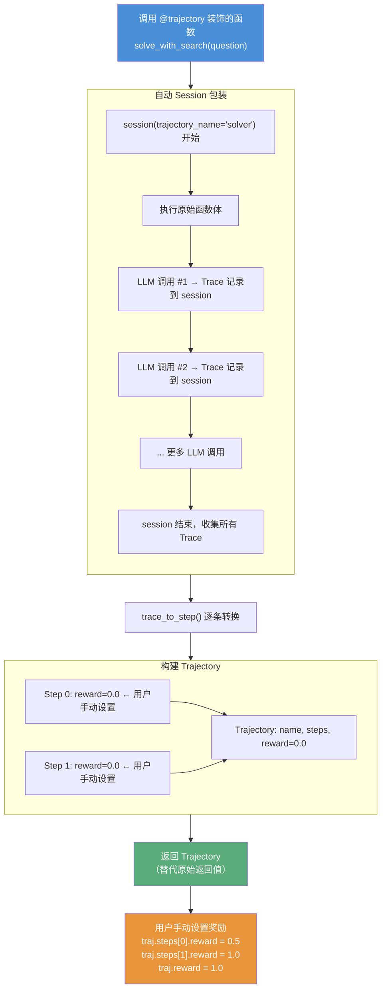

### 6.4 数据模型

SDK 完整的公开数据类型（来自 `rllm/sdk/__init__.py`）：

```python
from rllm.sdk import (
    # 核心数据类型
    Trace,          # 单次 LLM 调用记录
    Step,           # 带有奖励的 Trace（可赋 reward）
    Trajectory,     # Step 序列（完整的 Agent 交互轨迹）
    # 装饰器
    trajectory,     # 将函数标记为轨迹，返回 Trajectory 而非原始值
    # Session 管理
    session,                    # 创建 session 上下文（名称自动生成）
    get_current_session,        # 获取当前 session 实例
    get_current_session_name,   # 获取当前 session 名称
    get_current_metadata,       # 获取当前元数据
    # 客户端
    get_chat_client,            # 同步追踪客户端
    get_chat_client_async,      # 异步追踪客户端
    # Tracers
    InMemorySessionTracer,      # 内存 Tracer（即时访问）
    SqliteTracer,               # SQLite 持久化 Tracer
)
```

---

## 7. 教程一：训练数学解题 Agent（入门）

本教程演示使用 SDK 训练一个单步 Agent 解答数学题，是入门 rLLM SDK 最简单的方式。

**目标**：在 Hendrycks MATH 数据集上使用 GRPO 训练数学解题 Agent。

### 7.1 环境准备

```bash
cd rllm
# 准备数据集
python -m examples.simple_math.prepare_math_dataset

# 启动 vLLM 推理服务
vllm serve deepseek-ai/DeepSeek-R1-Distill-Qwen-1.5B \
    --host 0.0.0.0 \
    --port 4000
```

### 7.2 定义生成函数（Rollout）

```python
from rllm.sdk import get_chat_client

def generate_response(question: str) -> str:
    """生成数学问题的答案。这是你希望通过 RL 优化的核心行为。"""
    
    # 在函数内部创建客户端（Ray 序列化要求）
    client = get_chat_client(
        base_url="http://localhost:4000/v1",
        api_key="token-abc123"
    )
    
    # 发起 LLM 调用 —— 自动被追踪！
    response = client.chat.completions.create(
        model="deepseek-ai/DeepSeek-R1-Distill-Qwen-1.5B",
        messages=[
            {"role": "user", "content": question},
        ],
    )
    
    return response.choices[0].message.content

# 测试
print(generate_response("What is 2 + 2?"))
# 期望输出: "\boxed{4}"
```

### 7.3 定义奖励函数

```python
from rllm.rewards.reward_fn import math_reward_fn

def evaluate_response(response: str, ground_truth: str) -> float:
    """评估回答是否正确。返回 1.0 表示正确，0.0 表示错误。"""
    result = math_reward_fn(
        {"ground_truth": ground_truth},
        response  # 模型的完整回答
    )
    return result.reward
```

奖励函数的处理流程：

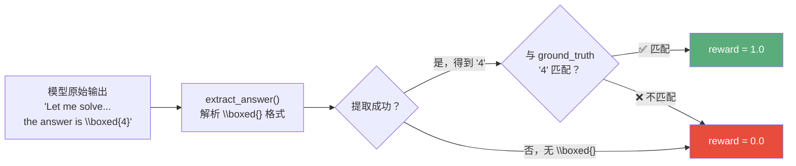

测试奖励函数：

```python
# 正确答案（boxed 格式）
reward = evaluate_response("The answer is \\boxed{4}", ground_truth="4")
print(f"Reward: {reward}")  # 1.0

# 有内容但格式不正确
reward = evaluate_response("After calculation, I get 4", ground_truth="4")
print(f"Reward: {reward}")  # 0.0（需要 \boxed{} 格式）

# 错误答案
reward = evaluate_response("The answer is \\boxed{5}", ground_truth="4")
print(f"Reward: {reward}")  # 0.0
```

### 7.4 合并为完整 Rollout 函数

```python
from rllm.sdk import get_chat_client
from rllm.rewards.reward_fn import math_reward_fn

def rollout(**kwargs) -> float:
    """训练函数：生成 + 评估。
    
    Args:
        question: 数学题目
        ground_truth: 正确答案
        
    Returns:
        float: 奖励值（正确 1.0，错误 0.0）
    """
    question = kwargs["question"]
    ground_truth = kwargs["ground_truth"]
    
    # Step 1：生成回答
    client = get_chat_client(
        base_url="http://localhost:4000/v1",
        api_key="EMPTY"
    )
    response = client.chat.completions.create(
        model="deepseek-ai/DeepSeek-R1-Distill-Qwen-1.5B",
        messages=[{"role": "user", "content": question}],
    )
    response_text = response.choices[0].message.content
    
    # Step 2：计算奖励
    reward = math_reward_fn(
        {"ground_truth": ground_truth},
        response_text
    ).reward
    
    return reward
```

### 7.5 配置 Trainer

```python
import hydra
from rllm.data.dataset import DatasetRegistry
from rllm.trainer.agent_trainer import AgentTrainer

@hydra.main(
    config_path="pkg://rllm.trainer.config",
    config_name="agent_ppo_trainer",
    version_base=None
)
def main(config):
    # 加载数据集
    train_dataset = DatasetRegistry.load_dataset("hendrycks_math", "train")
    test_dataset = DatasetRegistry.load_dataset("math500", "test")
    
    # 创建 Trainer，传入你的 Agent 函数
    trainer = AgentTrainer(
        config=config,
        train_dataset=train_dataset,
        val_dataset=test_dataset,
        agent_run_func=rollout,  # 你在上一步定义的函数
    )
    
    # 开始训练
    trainer.train()

if __name__ == "__main__":
    main()
```

### 7.6 训练超参配置

创建训练启动脚本 `train_hendrycks_math.sh`：

```bash
#!/bin/bash
set -x

export VLLM_ATTENTION_BACKEND=FLASH_ATTN
export PYTORCH_CUDA_ALLOC_CONF="expandable_segments:False"
export VLLM_USE_V1=1
export VLLM_ALLOW_LONG_MAX_MODEL_LEN=1
export VLLM_ENGINE_ITERATION_TIMEOUT_S=100000000000

MODEL_PATH=deepseek-ai/DeepSeek-R1-Distill-Qwen-1.5B

python train_hendrycks_math.py \
    algorithm.adv_estimator=grpo \
    data.train_batch_size=32 \
    data.val_batch_size=512 \
    data.max_prompt_length=2048 \
    data.max_response_length=2048 \
    actor_rollout_ref.model.path=$MODEL_PATH \
    actor_rollout_ref.hybrid_engine=True \
    actor_rollout_ref.actor.optim.lr=1e-6 \
    actor_rollout_ref.actor.strategy=fsdp2 \
    actor_rollout_ref.actor.loss_agg_mode=token-mean \
    actor_rollout_ref.model.use_remove_padding=True \
    actor_rollout_ref.actor.ppo_mini_batch_size=32 \
    actor_rollout_ref.actor.use_dynamic_bsz=True \
    actor_rollout_ref.actor.ppo_max_token_len_per_gpu=30000 \
    actor_rollout_ref.actor.use_kl_loss=False \
    actor_rollout_ref.actor.clip_ratio_high=0.28 \
    actor_rollout_ref.actor.kl_loss_coef=0.001 \
    actor_rollout_ref.actor.kl_loss_type=low_var_kl \
    actor_rollout_ref.actor.ulysses_sequence_parallel_size=1 \
    actor_rollout_ref.model.enable_gradient_checkpointing=True \
    actor_rollout_ref.actor.fsdp_config.param_offload=True \
    actor_rollout_ref.actor.fsdp_config.optimizer_offload=False \
    actor_rollout_ref.rollout.tensor_model_parallel_size=1 \
    actor_rollout_ref.rollout.name=vllm \
    actor_rollout_ref.rollout.mode="async" \
    actor_rollout_ref.rollout.gpu_memory_utilization=0.9 \
    actor_rollout_ref.rollout.enforce_eager=False \
    actor_rollout_ref.rollout.n=16 \
    actor_rollout_ref.rollout.temperature=0.6 \
    actor_rollout_ref.rollout.val_kwargs.n=1 \
    actor_rollout_ref.rollout.val_kwargs.temperature=0.6 \
    actor_rollout_ref.rollout.val_kwargs.top_p=0.9 \
    actor_rollout_ref.ref.fsdp_config.param_offload=True \
    actor_rollout_ref.ref.log_prob_micro_batch_size_per_gpu=1 \
    actor_rollout_ref.rollout.log_prob_micro_batch_size_per_gpu=1 \
    actor_rollout_ref.actor.entropy_coeff=0 \
    algorithm.kl_ctrl.kl_coef=0.001 \
    rllm.mask_truncated_samples=False \
    trainer.critic_warmup=0 \
    trainer.logger=['console','wandb'] \
    trainer.project_name='sdk-math' \
    trainer.experiment_name='sdk-math' \
    trainer.val_before_train=True \
    trainer.n_gpus_per_node=8 \
    trainer.nnodes=1 \
    trainer.save_freq=200 \
    trainer.test_freq=10 \
    rllm.agent.max_steps=1 \
    rllm.stepwise_advantage.enable=False \
    rllm.workflow.use_workflow=True \
    trainer.total_epochs=100 \
    rllm.sdk.proxy.host=127.0.0.1 \
    rllm.sdk.proxy.port=4000 \
    rllm.sdk.proxy.mode=subprocess \
    rllm.sdk.store.path="/tmp/rllm-traces.db"
```

### 7.7 启动训练

```bash
chmod +x train_hendrycks_math.sh
./train_hendrycks_math.sh
```

### 7.8 监控训练

训练日志默认输出到 WandB，关键监控指标：

| 指标 | 含义 |
|------|------|
| `critic/score/mean` | 每个 batch 的平均奖励 |
| `val/pass@1` | 验证集准确率 |

---

## 8. 教程二：训练 LangGraph RAG Agent（进阶）

本教程演示如何训练一个基于 LangGraph 的检索增强生成（RAG）Agent。这展示了 rLLM SDK 与主流 Agent 框架的无缝兼容性——你的 LangGraph 代码可以原封不动地运行。

**目标**：训练一个能有效利用搜索工具回答多跳问题（HotpotQA）的 RAG Agent。

### LangGraph RAG Agent 工作流

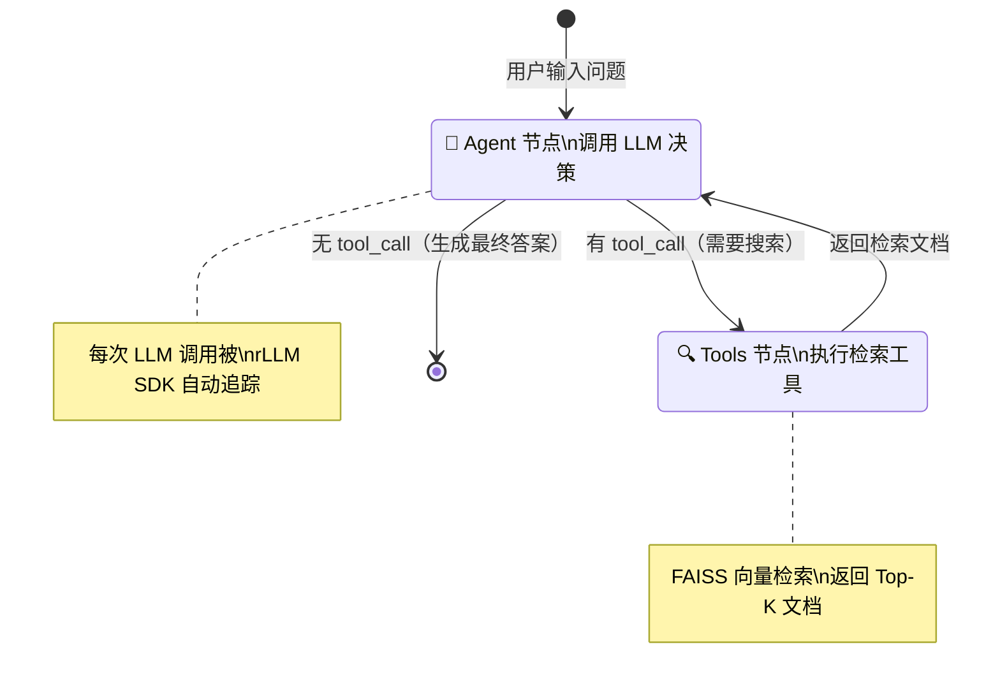

**核心概念**：
- **客户端注入**：将 ChatOpenAI 的内部 HTTP 客户端替换为追踪版本
- **LangGraph 工作流**：StateGraph、节点、边和 `tools_condition`
- **多轮追踪**：Agent 循环中所有 LLM 调用都被自动捕获

### 8.1 环境准备

```bash
# 安装依赖
pip install langchain-openai langgraph

# 准备 HotpotQA 数据集
cd examples/sdk/langgraph
python data/prepare_hotpotqa_data.py
python data/download_search_data.py --data_dir ./search_data

# 合并预构建的 FAISS 索引
cat search_data/prebuilt_indices/part_aa search_data/prebuilt_indices/part_ab \
    > search_data/prebuilt_indices/e5_Flat.index
mv search_data/wikipedia/wiki-18.jsonl search_data/prebuilt_indices/corpus.json

# 创建检索服务专用环境
conda create -n rag-server python=3.10 pip -y
pip install faiss-gpu==1.7.2 Flask numpy==1.26.4 sentence-transformers torch

# 启动检索服务（9002端口）
bash launch_server.sh ./search_data/prebuilt_indices 9002

# 启动 vLLM（需要启用 tool calling）
vllm serve Qwen/Qwen3-4B \
    --host 0.0.0.0 \
    --port 4000 \
    --enable-auto-tool-choice \
    --tool-call-parser hermes
```

### 8.2 客户端注入（关键步骤）

LangChain 的 `ChatOpenAI` 接受自定义 `client` 和 `async_client` 参数。通过注入追踪版本的客户端，所有 LLM 调用自动经过代理。

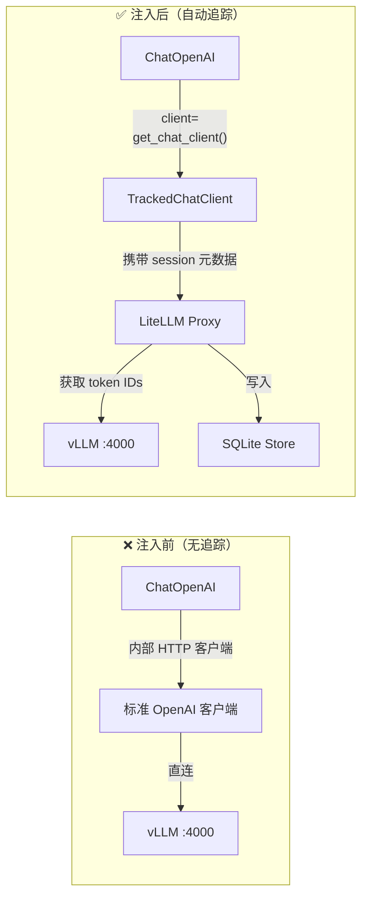

```python
from langchain_openai import ChatOpenAI
from rllm.sdk import get_chat_client, get_chat_client_async

# 普通 LangChain 用法（无追踪）
# llm = ChatOpenAI(model="Qwen/Qwen3-4B", api_key="token-abc123")

# 注入 rLLM SDK 追踪客户端
sync_client = get_chat_client(
    base_url="http://localhost:4000/v1",
    api_key="token-abc123"
)
async_client = get_chat_client_async(
    base_url="http://localhost:4000/v1",
    api_key="token-abc123"
)

# 注入到 ChatOpenAI
llm = ChatOpenAI(
    model="Qwen/Qwen3-4B",
    client=sync_client,        # ← 追踪版本！
    async_client=async_client, # ← 追踪版本！
)
```

这样，LangGraph 工作流逻辑完全不需要改变，追踪自动生效。

### 8.3 构建 LangGraph Agent

```python
import os
import re
from langchain_openai import ChatOpenAI
from langgraph.graph import END, START, MessagesState, StateGraph
from langgraph.prebuilt import ToolNode, tools_condition

from rllm.sdk import get_chat_client, get_chat_client_async

MODEL = "Qwen/Qwen3-4B"
MAX_RESPONSE_TOKENS = 2048

# 创建追踪客户端
async_client = get_chat_client_async(
    base_url="http://localhost:4000/v1",
    api_key="token-abc123",
)
sync_client = get_chat_client(
    base_url="http://localhost:4000/v1",
    api_key="token-abc123",
)

# 注入到 ChatOpenAI
response_model = ChatOpenAI(
    model=MODEL,
    temperature=1.0,
    max_tokens=MAX_RESPONSE_TOKENS,
    async_client=async_client,
    client=sync_client,
)

# 定义检索工具
from local_retrieval_tool import to_langchain_tool
retriever_tool = to_langchain_tool(
    server_url="http://127.0.0.1:9002",
    max_results=5,
    timeout=30.0,
)

# 系统提示
SYSTEM_PROMPT = """You are a helpful AI assistant that can search for information.

When answering questions:
1. Use the search tool to find relevant information
2. Synthesize information from multiple sources
3. Put your final answer in \\boxed{} format

Example: \\boxed{Paris}"""

# Agent 节点：决定调用工具还是给出最终答案
async def agent_step(state: MessagesState):
    response = await response_model.bind_tools([retriever_tool]).ainvoke(
        state["messages"]
    )
    return {"messages": [response]}

# 构建 StateGraph
workflow = StateGraph(MessagesState)
workflow.add_node("agent", agent_step)
workflow.add_node("tools", ToolNode([retriever_tool]))
workflow.add_edge(START, "agent")
workflow.add_conditional_edges(
    "agent",
    tools_condition,  # 根据是否有 tool call 路由到 "tools" 或 END
    {"tools": "tools", END: END},
)
workflow.add_edge("tools", "agent")
graph = workflow.compile()
```

### 8.4 定义 Run 函数

```python
from rllm.rewards.search_reward import RewardConfig, RewardSearchFn, RewardInput

async def run_search_agent(
    question: str,
    ground_truth: str,
    max_turns: int = 5
) -> dict:
    """运行 Agent 并计算奖励。"""
    
    final_answer = None
    num_turns = 0
    timed_out = False

    async for chunk in graph.astream(
        {
            "messages": [
                {"role": "system", "content": SYSTEM_PROMPT},
                {"role": "user", "content": question}
            ]
        },
        {"recursion_limit": max_turns * 2 + 5},
    ):
        for node_name, update in chunk.items():
            if node_name == "agent":
                num_turns += 1
                if num_turns > max_turns:
                    timed_out = True
                    break

            # 提取 \boxed{} 中的答案
            if "messages" in update and update["messages"]:
                content = update["messages"][-1].content
                match = re.search(r"\\boxed\{([^}]+)\}", content)
                if match:
                    final_answer = match.group(1)

        if timed_out:
            break

    # 计算奖励
    reward = 0.0
    if final_answer and not timed_out:
        reward_fn = RewardSearchFn(RewardConfig())
        reward = reward_fn(
            RewardInput(
                task_info={"ground_truth": ground_truth},
                action=final_answer
            )
        ).reward

    return {
        "final_answer": final_answer,
        "reward": reward,
        "num_turns": num_turns,
        "timed_out": timed_out,
    }
```

### 8.5 配置训练

```python
import hydra
from rllm.data import DatasetRegistry
from rllm.trainer.agent_trainer import AgentTrainer

async def run_agent(question, ground_truth, **kwargs):
    """训练包装器 —— 只返回奖励值。"""
    try:
        result = await run_search_agent(question, ground_truth)
        return result["reward"]
    except Exception:
        return 0.0

@hydra.main(
    config_path="pkg://rllm.trainer.config",
    config_name="agent_ppo_trainer",
    version_base=None
)
def main(config):
    train_dataset = DatasetRegistry.load_dataset("hotpotqa", "train")
    val_dataset = DatasetRegistry.load_dataset("hotpotqa-small", "test")

    trainer = AgentTrainer(
        config=config,
        train_dataset=train_dataset,
        val_dataset=val_dataset,
        agent_run_func=run_agent,
    )
    trainer.train()

if __name__ == "__main__":
    main()
```

### 8.6 启动训练

```bash
#!/bin/bash
# train_rag_agent.sh
set -x

export VLLM_ATTENTION_BACKEND=FLASH_ATTN
export PYTORCH_CUDA_ALLOC_CONF="expandable_segments:False"
export VLLM_USE_V1=1
export VLLM_ALLOW_LONG_MAX_MODEL_LEN=1
export VLLM_ENGINE_ITERATION_TIMEOUT_S=100000000000

python3 -m examples.sdk.langgraph.train_rag_agent \
    algorithm.adv_estimator=rloo \
    data.train_batch_size=64 \
    data.val_batch_size=512 \
    data.max_prompt_length=8192 \
    data.max_response_length=2048 \
    actor_rollout_ref.model.path=Qwen/Qwen3-4B \
    actor_rollout_ref.hybrid_engine=True \
    actor_rollout_ref.actor.optim.lr=1e-6 \
    actor_rollout_ref.model.use_remove_padding=True \
    actor_rollout_ref.actor.loss_agg_mode=seq-mean-token-sum \
    actor_rollout_ref.actor.ppo_mini_batch_size=32 \
    actor_rollout_ref.actor.use_dynamic_bsz=True \
    actor_rollout_ref.actor.ppo_max_token_len_per_gpu=24000 \
    actor_rollout_ref.actor.use_kl_loss=False \
    actor_rollout_ref.actor.clip_ratio_high=0.28 \
    actor_rollout_ref.rollout.name=vllm \
    actor_rollout_ref.rollout.mode="async" \
    actor_rollout_ref.rollout.enforce_eager=False \
    actor_rollout_ref.rollout.temperature=1.0 \
    actor_rollout_ref.rollout.gpu_memory_utilization=0.75 \
    +actor_rollout_ref.rollout.engine_kwargs.vllm.enable_auto_tool_choice=True \
    +actor_rollout_ref.rollout.engine_kwargs.vllm.tool_call_parser=hermes \
    actor_rollout_ref.rollout.n=8 \
    actor_rollout_ref.rollout.val_kwargs.n=1 \
    actor_rollout_ref.rollout.val_kwargs.temperature=0.7 \
    actor_rollout_ref.rollout.val_kwargs.top_p=0.8 \
    actor_rollout_ref.rollout.val_kwargs.top_k=20 \
    actor_rollout_ref.ref.fsdp_config.param_offload=True \
    trainer.logger=['console','wandb'] \
    trainer.project_name='sdk-langgraph-rag' \
    trainer.experiment_name='sdk-langgraph-rag' \
    trainer.n_gpus_per_node=8 \
    trainer.nnodes=1 \
    trainer.save_freq=40 \
    trainer.test_freq=10 \
    rllm.agent.max_steps=10 \
    trainer.total_epochs=100 \
    rllm.sdk.proxy.host=127.0.0.1 \
    rllm.sdk.proxy.port=4000 \
    rllm.sdk.proxy.mode=subprocess \
    rllm.sdk.store.path="/tmp/rllm-traces.db"
```

```bash
cd ~/rllm
bash examples/sdk/langgraph/train_rag_agent.sh
```

---

## 9. 进阶：细粒度 Session 控制

### 何时需要显式 Session？

| 使用场景 | 推荐方式 |
|----------|----------|
| 单轮 Agent | ❌ 不需要，Trainer 自动处理 |
| 多轮 Agent + 最终奖励 | ❌ 不需要，Trainer 自动处理 |
| 多轮 Agent + 逐步奖励 | ✅ 使用显式 Session 或 `@trajectory` |
| 需要自定义每次 LLM 调用的元数据 | ✅ 使用显式 Session |
| 调试 trace 捕获 | ✅ 使用显式 Session |

### 显式 Session 用法

```python
from rllm.sdk import session, get_chat_client

client = get_chat_client(base_url="http://localhost:4000/v1")

# 手动管理 session，添加自定义元数据
with session(experiment="v1", task_id="math_001", difficulty="hard") as sess:
    response = client.chat.completions.create(
        model="Qwen/Qwen3-4B",
        messages=[{"role": "user", "content": "What is 2+2?"}]
    )
    
    # 直接访问捕获的 traces
    print(f"捕获了 {len(sess.llm_calls)} 次 LLM 调用")
    print(f"Token IDs: {sess.llm_calls[0].output.output_token_ids}")
```

### 与 LangGraph 结合使用

```python
from langgraph.graph import StateGraph, MessagesState
from rllm.sdk import get_chat_client, session

client = get_chat_client(base_url="http://localhost:4000/v1")

async def agent_step(state: MessagesState):
    response = await client.chat.completions.create(
        model="Qwen/Qwen3-4B",
        messages=state["messages"]
    )
    return {"messages": [response.choices[0].message]}

workflow = StateGraph(MessagesState)
workflow.add_node("agent", agent_step)
# ... 添加边，编译 ...
graph = workflow.compile()

# 使用显式 session 精细控制追踪
with session(task_id="hotpotqa_001", max_turns=5):
    result = await graph.ainvoke({"messages": [...]})
```

---

## 10. Session 后端：ContextVar vs OpenTelemetry

SDK 支持两种 Session 后端，在 `rllm/sdk/config.yaml` 中配置：

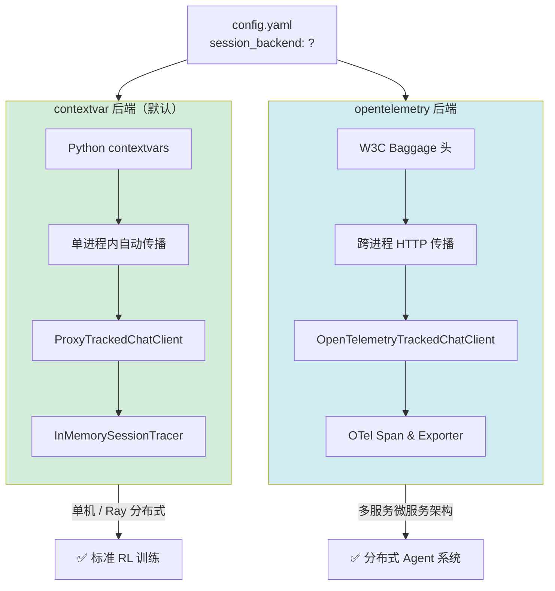

| 后端 | 标识符 | 适用场景 | 技术原理 |
|------|--------|----------|----------|
| **ContextVar**（默认） | `contextvar` | 单进程内的追踪 | Python `contextvars` |
| **OpenTelemetry** | `opentelemetry` | 跨进程分布式追踪 | W3C Baggage 传播 |

### ContextVar 后端（默认）

基于 Python 内置的 `contextvars` 模块，自动在同一进程内传播上下文：

```python
from rllm.sdk import session, get_chat_client

client = get_chat_client(base_url="http://localhost:4000/v1")

with session(experiment="v1") as sess:
    client.chat.completions.create(...)
    # sess.llm_calls 包含本 session 中所有 LLM 调用的 Trace
```

### OpenTelemetry 后端（分布式追踪）

用于跨进程（如 HTTP 边界）的上下文传播：

```python
from rllm.sdk.session import otel_session, configure_default_tracer

# 每个进程配置一次
configure_default_tracer(service_name="my-agent")

# 客户端进程
with otel_session(name="client") as client_session:
    # HTTP 调用会自动携带 W3C baggage 头传递 session 上下文
    httpx.post("http://server/api", ...)

# 服务端进程
with otel_session(name="handler") as server_session:
    client.chat.completions.create(...)
    # server_session 自动继承客户端的 UID 链
```

OpenTelemetry 后端特性：
- W3C baggage 作为 session 状态的唯一数据源
- 跨 HTTP 边界自动传播上下文
- 基于 Span 的 session UID，兼容 OpenTelemetry 观测工具

---

## 11. SDK 内部架构与目录结构

```
rllm/sdk/
├── __init__.py              # 公开 API 导出
├── config.yaml              # Session 后端配置
├── protocol.py              # 数据模型（Trace、Step、Trajectory）
├── decorators.py            # @trajectory 装饰器实现
├── shortcuts.py             # session()、get_chat_client() 快捷函数
├── data_process.py          # Trace 到模型输入的转换工具
├── session/
│   ├── __init__.py          # Session 导出，SESSION_BACKEND 配置读取
│   ├── base.py              # SessionProtocol、wrap_with_session_context()
│   ├── contextvar.py        # ContextVarSession（默认后端）
│   ├── opentelemetry.py     # OpenTelemetrySession（W3C baggage 方案）
│   └── session_buffer.py    # SessionBuffer（临时 trace 存储）
├── chat/
│   ├── __init__.py          # Chat 客户端导出
│   ├── openai.py            # 统一 OpenAI 聊天客户端（所有客户端类型）
│   └── util.py              # Chat 客户端工具函数
├── proxy/
│   ├── __init__.py          # 代理模块导出
│   ├── litellm_callbacks.py # TracingCallback、SamplingParametersCallback
│   ├── litellm_server.py    # LiteLLM 服务器集成
│   ├── metadata_slug.py     # URL 元数据编解码
│   ├── middleware.py        # MetadataRoutingMiddleware（ASGI）
│   └── proxy_manager.py    # 代理生命周期管理
├── tracers/
│   ├── __init__.py          # Tracer 导出
│   ├── base.py              # TracerProtocol 接口定义
│   ├── memory.py            # InMemorySessionTracer
│   └── sqlite.py            # SqliteTracer
├── store/
│   ├── __init__.py          # Store 导出
│   └── sqlite_store.py      # SQLite trace 持久化存储
└── integrations/
    ├── adk.py               # Google ADK 插件（RLLMTrajectoryPlugin）
    ├── openai_agents.py     # OpenAI Agents SDK 钩子（RLLMTrajectoryHooks）
    └── strands.py           # Strands Agents SDK 钩子（RLLMTrajectoryHookProvider）
```

### 核心流程：客户端如何拦截调用

`TrackedChatClient` 继承自 `OpenAI`，覆写 `request()` 方法，这是拦截所有 API 调用最干净的方式（无 Monkey-patching）。下面是一次完整 LLM 调用的序列图：

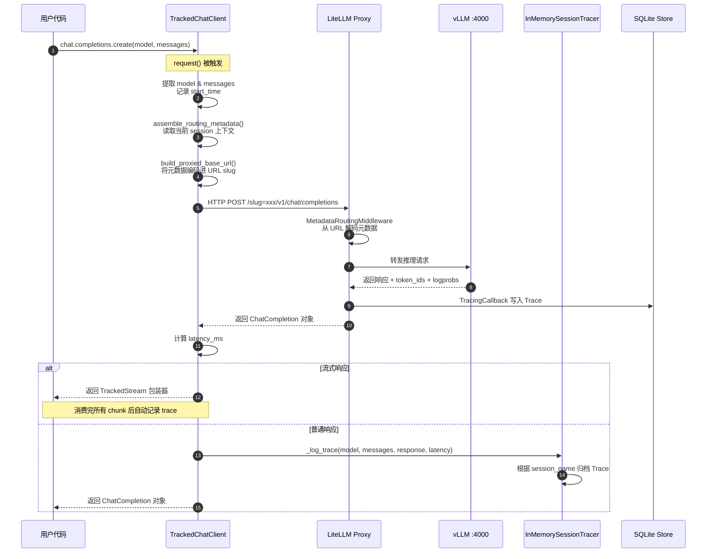

```python
class TrackedChatClient(OpenAI):
    """通过覆写 request() 实现自动追踪的 OpenAI 客户端。"""

    def request(self, cast_to, options, *, stream=False, stream_cls=None):
        # 1. 提取 model 和 messages 用于追踪
        model = options.json_data.get("model")
        messages = options.json_data.get("messages")
        start_time = time.perf_counter()

        # 2. 注入代理路由元数据（如果启用）
        if self._use_proxy and self._proxy_base_url:
            routing_metadata = assemble_routing_metadata()
            if routing_metadata:
                new_base_url = build_proxied_base_url(self._proxy_base_url, routing_metadata)
                temp_client = OpenAI.with_options(self, base_url=new_base_url)
                response = OpenAI.request(temp_client, cast_to, options, ...)
        ...

        # 3. 记录 trace（仅对 /chat/completions 端点）
        if _is_chat_completions_endpoint(options.url) and self._enable_local_tracing:
            if _is_streaming_response(response):
                return TrackedStream(...)  # 流式响应，消费完后记录
            else:
                latency_ms = (time.perf_counter() - start_time) * 1000
                _log_trace(self._tracer, model=model, messages=messages, ...)

        return response
```

### 代理模块的元数据路由

SDK 通过将元数据编码到 URL 路径中传递给 LiteLLM 代理：

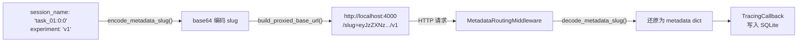

```python
from rllm.sdk.proxy import encode_metadata_slug, build_proxied_base_url

metadata = {"session_name": "my-session", "experiment": "v1"}
slug = encode_metadata_slug(metadata)
proxied_url = build_proxied_base_url("http://localhost:8000", metadata)
# proxied_url 形如: "http://localhost:8000/slug=<encoded>/v1"
```

### SDK 模块依赖关系

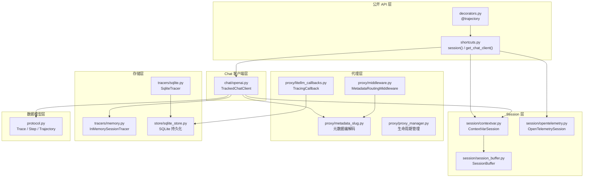

---

## 12. 设计原则

| 原则 | 说明 |
|------|------|
| **最小 API 面** | 简洁、聚焦的对外函数，避免过度封装 |
| **基于上下文** | 使用 Python `contextvars` 自动传播，无需手动传参 |
| **分布式就绪** | OpenTelemetry 后端支持跨进程追踪 |
| **可插拔存储** | 支持内存、SQLite 或自定义 Storage 后端 |
| **类型安全** | 完整的类型注解，使用 Pydantic 模型 |
| **原生异步** | 一等公民的 async/await 支持 |
| **代理集成** | 内置 LiteLLM 代理路由支持 |

---

## 13. 参考资料

- [重分词问题在 RL 训练中的影响](https://wandb.ai/tianhaowu/rllm-agent/reports/Tokenization-Mismatch-in-Text-Level-Operations--VmlldzoxNDg0MTcwMw)
- [VERL：分布式 RL 训练框架](https://github.com/volcengine/verl)
- [LiteLLM Proxy 文档](https://docs.litellm.ai/docs/proxy/quick_start)
- [源文档：SDK 核心概念](./core-concepts/sdk.md)
- [源文档：数学 Agent 教程](./examples/sdk_math.md)
- [源文档：LangGraph RAG 交互教程](./examples/sdk_langgraph_rag.md)
- [SDK README](../rllm/sdk/README.md)
