# rLLM 框架深度解析：完整技术教程

> 本文档是对 [rLLM](https://github.com/rllm-org/rllm) v0.3.0 代码框架的全面深度分析，以教材形式由浅入深，帮助读者理解其架构设计、核心实现与特性支持。

---

# 第一章：全局架构总览

## 1.1 rLLM 是什么

rLLM（Reinforcement Learning for Language Models）是由 Berkeley Sky Computing Lab 开发的开源框架，用于使用强化学习（RL）来训练 AI Agent。它的核心理念是：

> **运行你的 Agent → 收集轨迹 → 计算奖励 → 更新模型**

```
┌──────────────┐    ┌──────────────┐    ┌──────────────┐    ┌──────────────┐
│  Your Agent  │───▶│    Traces     │───▶│   Rewards    │───▶│  RL Update   │
│  (any code)  │    │  (auto-logged)│    │ (your logic) │    │  (GRPO etc.) │
└──────────────┘    └──────────────┘    └──────────────┘    └──────────────┘
```

rLLM 的独特之处在于它支持**任意 Agent 框架**（LangGraph、SmolAgent、Strands、OpenAI Agents SDK、Google ADK 等），用户只需极少的代码修改即可接入 RL 训练。

## 1.2 三层架构分解

rLLM 的代码可以清晰地分解为三个层次：

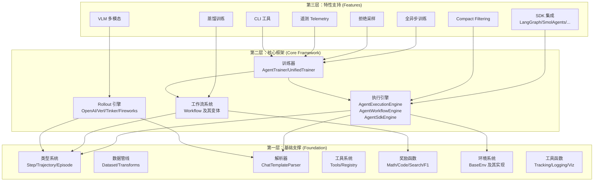

### 层次一：基础支撑层

提供框架运行所需的基本数据结构、解析能力和工具支持。这一层是纯粹的"基础设施"，不涉及训练逻辑。

| 模块 | 路径 | 职责 | 支撑的上层功能 |
|------|------|------|---------------|
| 类型系统 | `rllm/types.py`, `rllm/agents/agent.py` | 定义 Step/Trajectory/Episode 数据结构 | 所有上层模块 |
| 数据管线 | `rllm/data/` | 数据加载、字段标准化转换 (50+数据集) | 训练器读取训练/验证数据 |
| Chat 解析器 | `rllm/parser/` | Chat 模板解析、token化、loss mask 生成 | 执行引擎组装训练数据 |
| 工具系统 | `rllm/tools/` | 工具定义、注册、调用 (code/web/MCP) | Agent 使用工具与环境交互 |
| 奖励函数 | `rllm/rewards/` | 数学/代码/搜索/F1 奖励计算 | Workflow 计算 step 级奖励 |
| 环境系统 | `rllm/environments/` | BaseEnv 及具体环境实现 | 执行引擎驱动 Agent-环境交互 |
| 工具函数 | `rllm/utils/` | 日志、追踪、可视化 | 训练过程日志记录与观测 |

### 层次二：核心框架层

实现 "收集轨迹 → 计算优势 → 更新策略" 这一 RL 训练核心循环。

| 模块 | 路径 | 职责 |
|------|------|------|
| 执行引擎 | `rllm/engine/` | 三种模式编排 Agent 运行并收集轨迹 |
| 工作流系统 | `rllm/workflows/` | 封装 Agent-环境交互的标准模式 |
| Rollout 引擎 | `rllm/engine/rollout/` | 对接不同推理后端，获取模型响应 |
| 训练器 | `rllm/trainer/`, `rllm/experimental/unified_trainer.py` | 编排完整训练循环 |

### 层次三：特性支持层

在核心训练循环之上叠加的可选增强功能。

| 特性 | 路径 | 功能 |
|------|------|------|
| SDK 集成 | `rllm/sdk/integrations/` | 适配 LangGraph/SmolAgents/Strands/ADK/OpenAI Agents |
| 全异步训练 | `rllm/experimental/fully_async/` | 训练与推理完全异步并行 |
| 蒸馏训练 | `rllm/workflows/distillation_workflow.py`, `rllm/trainer/distill/` | 教师-学生 on-policy 蒸馏 |
| 拒绝采样 | `rllm/experimental/common/rejection_sampling.py` | 过滤低质量轨迹 |
| Compact Filtering | 配置项 `rllm.compact_filtering` | 按终止原因过滤无效 episode |
| VLM 多模态 | 解析器 + Qwen VL 支持 | 视觉语言模型训练 |
| CLI | `rllm/experimental/cli/` | 命令行 eval/train 一键运行 |
| 遥测 | `rllm/experimental/rllm_telemetry/` | OpenTelemetry 追踪 |

## 1.3 项目目录结构

```
rllm/
├── rllm/                     # 核心框架代码
│   ├── __init__.py           # 顶层导出: BaseAgent, Step, Trajectory, Episode, rollout, evaluator
│   ├── types.py              # 轻量级规范类型 (SDK 使用)
│   ├── agents/               # Agent 抽象与具体实现
│   ├── engine/               # 执行引擎 (三种模式)
│   │   └── rollout/          # Rollout 引擎 (OpenAI/Verl/Tinker/Fireworks)
│   ├── workflows/            # 工作流模式 (5 种变体)
│   ├── trainer/              # 训练器 (verl/tinker/fireworks 后端)
│   │   └── verl/             # Verl 后端的 PPO 训练器
│   ├── data/                 # 数据集加载与转换
│   ├── parser/               # Chat 模板解析器
│   ├── rewards/              # 奖励函数
│   ├── tools/                # 工具系统
│   ├── environments/         # 环境系统
│   ├── sdk/                  # SDK 系统 (自动 trace 收集)
│   ├── experimental/         # 实验性功能 (unified trainer, CLI, fully async)
│   ├── integrations/         # 外部框架集成 (verifiers)
│   ├── patches/              # vLLM/Verl 补丁
│   ├── registry/             # 数据集/Agent 注册表
│   └── utils/                # 工具函数
├── rllm-model-gateway/       # 模型网关 (LiteLLM proxy)
├── agenthub/                 # 社区贡献的 Agent 实现
├── cookbooks/                # 完整示例 (geo3k, solver-judge)
├── examples/                 # 各种示例脚本
├── projects/                 # 独立项目
├── scripts/                  # 运行脚本
├── tests/                    # 测试
└── docs/                     # 文档
```

## 1.4 外部框架依赖关系

rLLM 并非独立存在，它与多个外部框架紧密耦合：

| 外部框架 | 角色 | 集成方式 |
|----------|------|----------|
| **verl** (v0.6.1) | 分布式训练后端 (FSDP + vLLM) | `rllm/trainer/verl/` 中的 PPO 训练器继承 verl 的 `DataProto` |
| **vLLM** (0.10-0.11) | 大规模推理引擎 | 通过 verl 间接使用，`VerlEngine` 适配 |
| **Tinker** | 单机/CPU 训练后端 | `rllm/trainer/tinker/` 适配 |
| **LiteLLM** | API 代理/trace 收集 | SDK 模式下通过 proxy 透明拦截 LLM 调用 |
| **Ray** | 分布式任务调度 | verl 后端的分布式训练协调 |
| **HuggingFace** | 模型/数据集/Tokenizer | 数据集加载、模型加载、chat template |
| **各 Agent 框架** | 用户的 Agent 代码 | SDK 集成层自动拦截 LLM 调用 |

---

> 接下来的章节将逐层深入分析每个子系统的实现细节与调用关系。
# 第二章：基础支撑层详解

本章详细拆解 rLLM 框架底层的每个基础组件，理解它们的实现方式以及如何支撑上层核心框架运行。

---

## 2.1 类型系统：Step → Trajectory → Episode

### 2.1.1 双层类型架构

rLLM 采用了一种精巧的**双层类型继承**设计：

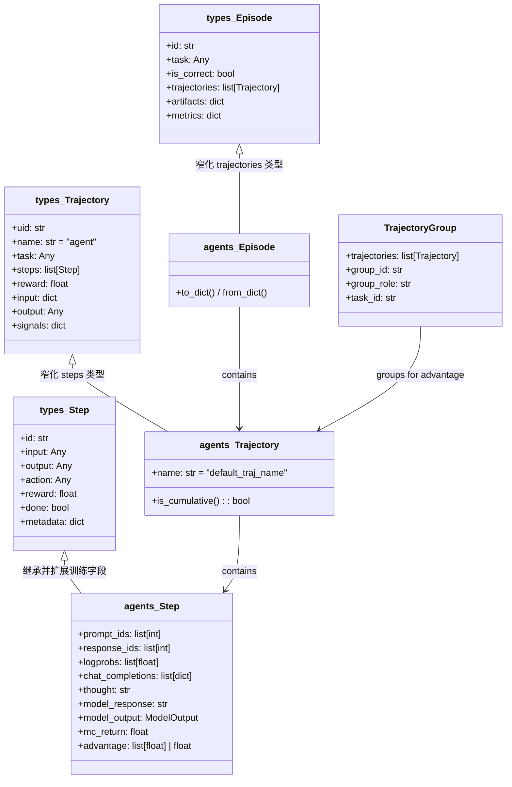

**设计意图**：
- `rllm/types.py` 中的 **轻量级类型** 作为 SDK 使用的规范类型，不依赖 PyTorch
- `rllm/agents/agent.py` 中的 **训练类型** 继承基础类型，添加 `prompt_ids`、`logprobs`、`advantage` 等训练专用字段
- 这确保了 SDK 用户（仅做推理/评估）不需要安装 PyTorch 等重依赖

### 2.1.2 核心字段说明

**Step（一次 LLM 调用）**：

| 字段 | 来源 | 用途 |
|------|------|------|
| `prompt_ids` | ModelOutput 回填 | 训练时构建 input_ids |
| `response_ids` | ModelOutput 回填 | 训练时构建 response tensor |
| `logprobs` | ModelOutput 回填 | 计算 KL 散度、PPO ratio |
| `chat_completions` | Agent 维护 | 多轮对话的完整消息历史 |
| `model_output` | RolloutEngine 返回 | 包含推理的完整输出 |
| `advantage` | 训练时计算 | per-token 或 scalar 优势值 |
| `mc_return` | 蒙特卡洛回报 | γ 折扣的累积奖励 |

**TrajectoryGroup（用于优势计算的轨迹分组）**：
- 将同一 task 的多个 rollout 分为一组
- GRPO 等算法在组内比较 reward 来计算优势
- `group_role` 区分不同 agent 角色（如 solver vs judge）

### 2.1.3 `model_post_init` 自动回填

```python
def model_post_init(self, __context):
    if self.model_output is None:
        return
    # 自动从 ModelOutput 回填 prompt_ids, response_ids, logprobs
    if len(self.prompt_ids) == 0 and self.model_output.prompt_ids is not None:
        self.prompt_ids = self.model_output.prompt_ids
    ...
```

> 当 Step 直接从 `ModelOutput` 构建时，训练所需的 token ID 和 log probability 被自动填充，无需用户手动传递。

---

## 2.2 数据管线：Dataset 与 Transforms

### 2.2.1 Dataset 类 ([dataset.py](file:///home/robomaster/Research/rllm/rllm/data/dataset.py))

`Dataset` 类是对 HuggingFace `datasets` 的封装，提供：
1. **注册表驱动加载** - `datasets.json` 定义 50+ 数据集的 HF 路径、split、transform 函数
2. **字段标准化** - 所有数据集通过 transform 转换为统一格式
3. **与 verl 集成** - `get_verl_data_path()` 将数据转为 verl 可读的 parquet 格式

### 2.2.2 Transform 函数体系 ([transforms.py](file:///home/robomaster/Research/rllm/rllm/data/transforms.py), 1324 行)

每个 transform 是一个纯函数：`dict → dict`，将原始 HuggingFace 行转为标准字段。

**按类别划分的 50+ transform**：

| 类别 | Transform 函数 | 标准输出字段 |
|------|---------------|-------------|
| **数学** | `gsm8k_transform`, `math500_transform`, `aime_transform`, `hmmt_transform` | `question`, `ground_truth`, `data_source` |
| **代码** | `humaneval_transform`, `mbpp_transform`, `livecodebench_transform` | `question`, `ground_truth`, `entry_point`, `task_id` |
| **MCQ** | `gpqa_diamond_transform`, `mmlu_pro_transform`, `ceval_transform`, `include_transform` | `question`, `choices`, `ground_truth` |
| **QA** | `hotpotqa_transform`, `hle_transform`, `aa_lcr_transform` | `question`, `ground_truth` |
| **VLM** | `mmmu_transform`, `mathvista_transform`, `zerobench_transform`, `ai2d_transform` | `question`, `images`, `choices`, `ground_truth` |
| **多语言** | `mmmlu_transform`, `mmlu_prox_transform`, `polymath_transform`, `wmt24pp_transform` | 含 `language` 字段 |
| **Agentic** | `multichallenge_transform` | `turns`, `question`, `ground_truth` |

> **设计特点**：GPQA Diamond 使用基于问题哈希的**确定性洗牌**来避免选项偏差：
> ```python
> seed = int(hashlib.md5(row["Question"].encode()).hexdigest(), 16) % (2**32)
> rng = random.Random(seed)
> rng.shuffle(indices)
> ```

---

## 2.3 Chat 模板解析器

### 2.3.1 解析器继承体系

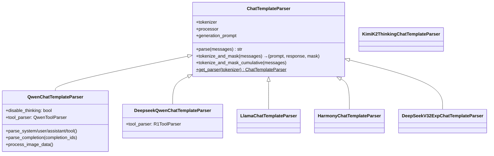

### 2.3.2 `get_parser` 自动识别

`ChatTemplateParser.get_parser()` 基于 tokenizer 的 `name_or_path` 自动选择合适的解析器：

| 模型关键词 | 解析器 |
|-----------|--------|
| `deepseek` + `llama` tokenizer | `DeepseekQwenChatTemplateParser` |
| `qwen` / `r2e` / `deepswe` | `QwenChatTemplateParser` |
| `llama` | `LlamaChatTemplateParser` |
| `gpt-oss` / `imo` | `HarmonyChatTemplateParser` |
| `kimi-k2` | `KimiK2ThinkingChatTemplateParser` |

### 2.3.3 `tokenize_and_mask` — 训练数据构建的核心

这两个方法将 chat completion 列表转换为训练所需的 `(prompt_ids, response_ids, response_mask)` 三元组：

- **`tokenize_and_mask`**：单步场景，仅最后一个 assistant 消息作为 response（mask=1）
- **`tokenize_and_mask_cumulative`**：多步场景，所有 assistant 消息的 token mask=1，非 assistant（环境观察等）mask=0

> 这是训练数据构建的**最关键**环节——确保只对模型生成的 token 计算 loss，而非环境或用户的 token。

---

## 2.4 奖励函数系统

### 2.4.1 RewardFunction Protocol

```python
@runtime_checkable
class RewardFunction(Protocol):
    def __call__(self, task_info: dict, action: str) -> RewardOutput: ...
```

任何符合此签名的可调用对象都可作为奖励函数。

### 2.4.2 内置奖励函数

| 奖励函数 | 文件 | 评估方式 |
|----------|------|----------|
| `math_reward_fn` | `math_reward.py` | 数学表达式等价性检查 (SymPy) |
| `code_reward_fn` | `code_reward.py` | 代码执行 + 测试用例验证 |
| `search_reward_fn` | `search_reward.py` | 搜索/QA 任务的答案匹配 |
| `f1_reward_fn` | `reward_fn.py` | F1 分数（token overlap） |
| `zero_reward` | `reward_fn.py` | 恒返回 0 的占位奖励 |

### 2.4.3 MathReward 的评估链

数学奖励使用多级匹配策略：先尝试精确匹配 → SymPy 符号等价 → LaTeX 解析等价 → 数值近似。这确保了对不同表示形式的数学答案的鲁棒评估。

---

## 2.5 环境系统

### 2.5.1 BaseEnv 抽象

```python
class BaseEnv(ABC):
    @abstractmethod
    def reset(self, task=None) -> tuple[Any, dict]: ...
    
    @abstractmethod
    def step(self, action) -> tuple[Any, float, bool, dict]: ...
    
    @classmethod
    def is_multithread_safe(cls) -> bool: ...
    
    @classmethod
    def from_dict(cls, data: dict) -> "BaseEnv": ...
```

### 2.5.2 环境实现

| 环境 | 路径 | 用途 |
|------|------|------|
| `frozenlake/` | RL 入门示例 | FrozenLake 网格世界 |
| `code/` | 代码执行 | 沙盒化代码运行 |
| `swe/` | 软件工程 | SWEBench 评估 |
| `browsergym/` | 网页交互 | 浏览器自动化 |
| `appworld/` | 应用交互 | AppWorld 基准 |
| `tools/` | 工具使用 | 通用工具调用环境 |

> **关键约束**：`is_multithread_safe()` — 执行引擎使用异步并发，环境必须声明线程安全才能被使用。

---

## 2.6 工具系统

### 2.6.1 Tool 抽象层级

```
Tool (基类)
├── CodeTool          # 代码执行工具
├── WebTool           # 网页搜索/浏览工具
├── MCPTool           # MCP 协议工具
└── MultiTool         # 组合多个子工具
```

### 2.6.2 ToolRegistry

`ToolRegistry` 提供工具的注册与发现机制，支持按名称查找和批量加载。Agent 通过 registry 获取可用工具列表，并在对话中以 JSON schema 形式展示给模型。

---

## 2.7 工具函数层

### 2.7.1 Tracking ([tracking.py](file:///home/robomaster/Research/rllm/rllm/utils/tracking.py), 37K)

支持多种日志后端：
- **WandB** — 实验追踪
- **TensorBoard** — 标量/图形日志
- **Console** — 终端打印

### 2.7.2 EpisodeLogger

将每个 episode 的完整信息序列化保存到磁盘（JSON 格式），用于调试和离线分析。

### 2.7.3 Visualization

`trajectory_visualizer.py`（27K）提供 HTML 可视化，用于在 rLLM UI 中展示 Agent 轨迹。
# 第三章：核心框架层详解

本章深入分析 rLLM 的核心训练循环实现，包括执行引擎、工作流系统、Rollout 引擎和训练器。

---

## 3.1 Rollout 引擎：模型推理的统一抽象

### 3.1.1 基类 RolloutEngine

```python
class RolloutEngine:
    async def get_model_response(self, messages: list[dict], **kwargs) -> ModelOutput: ...
    async def wake_up(self): ...   # 激活推理服务
    async def sleep(self): ...     # 休眠推理服务
```

`ModelOutput` 是所有引擎的标准返回：

```python
@dataclass
class ModelOutput:
    text: str               # 完整文本输出
    content: str            # 内容部分（去除 reasoning）
    reasoning: str          # 思考过程
    tool_calls: list[ToolCall]  # 工具调用
    prompt_ids: list[int]       # prompt token IDs
    completion_ids: list[int]   # completion token IDs
    logprobs: list[float]       # 每个 completion token 的 log probability
    finish_reason: str          # "stop" / "length"
```

### 3.1.2 四种 Rollout 引擎实现

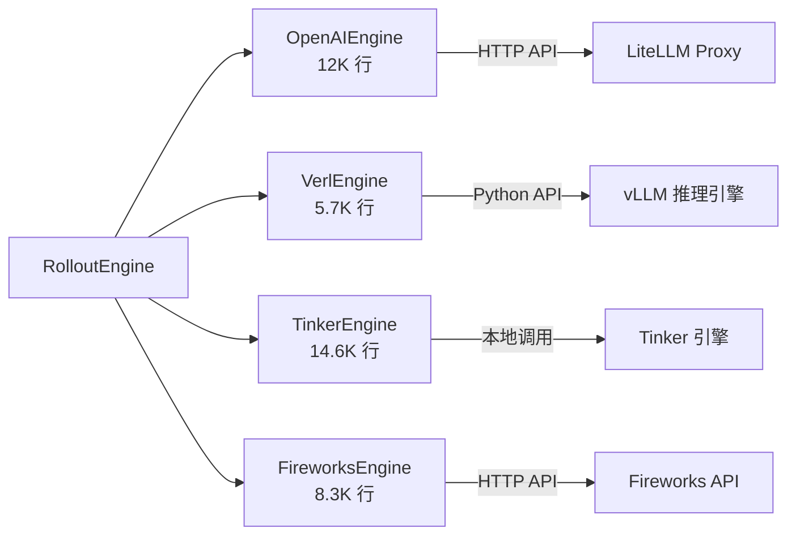

| 引擎 | 场景 | 特点 |
|------|------|------|
| **OpenAIEngine** | 通用，通过 API 推理 | 兼容任何 OpenAI API；自动 tokenize 和 mask |
| **VerlEngine** | 分布式 GPU 训练 | 直接与 vLLM 的 rollout manager 交互；自动 wake_up/sleep |
| **TinkerEngine** | 单机/CPU 训练 | Python 3.11+；本地推理 |
| **FireworksEngine** | 管道式训练 | 通过 Fireworks API 进行推理 |

### 3.1.3 VerlEngine 的 wake_up/sleep 机制

```python
async def wake_up(self):
    # 将 vLLM 引擎的模型权重恢复到 GPU
    self.rollout_manager.wake_up()

async def sleep(self):
    # 将模型权重卸载，释放 GPU 显存给训练
    self.rollout_manager.sleep()
```

> 这是 verl 框架的核心优化：**推理和训练交替占用 GPU**，避免双份显存开销。

---

## 3.2 三种执行引擎

执行引擎是 rLLM 中**编排 Agent 运行、收集轨迹**的核心组件。rLLM 提供三种引擎模式以适应不同使用场景：

### 3.2.1 完整调用关系图

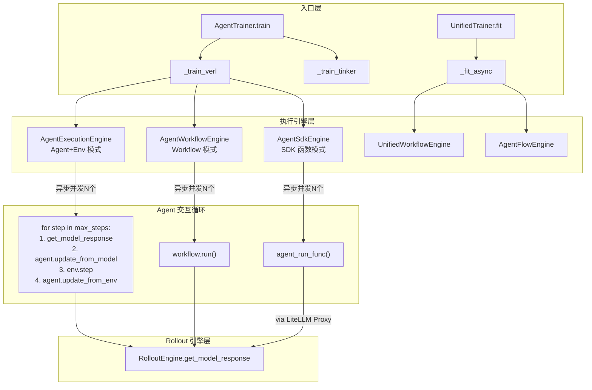

### 3.2.2 AgentExecutionEngine（Agent+Env 模式）

**文件**：[agent_execution_engine.py](file:///home/robomaster/Research/rllm/rllm/engine/agent_execution_engine.py) (627行)

**核心循环**（`run_agent_trajectory_async`）：

```
环境 reset → agent.update_from_env(初始观察)
for step in range(max_steps):
    1. messages = agent.chat_completions   # 构建 prompt
    2. model_output = get_model_response() # 调用 LLM
    3. action = agent.update_from_model()  # Agent 处理响应
    4. obs, reward, done, info = env.step(action)  # 环境执行
    5. agent.update_from_env()             # 更新 Agent 状态
    6. 检查终止条件：token超限/超时/env_done/max_steps
```

**四种输出模式**：

| 模式 | 输出 | 用途 |
|------|------|------|
| `Text` | `Trajectory` 对象 | 默认，用于 Workflow 引擎 |
| `Token` | `{prompt_tokens, response_tokens, response_masks}` | 直接转为训练 tensor |
| `Conversation` | `chat_completions` 列表 | 对话日志 |
| `Step` | `{steps, trajectory_reward, mc_returns}` | 步级分析 |

**关键方法 `assemble_steps`**：

将多步对话组装为训练格式——验证每一步的 `prompt_ids` 是否为前一步 `accumulated_sequence` 的前缀（**累积性检查**），如果不一致说明存在重新 tokenize 问题，将 response_masks 全部置 0（丢弃该样本）。

### 3.2.3 AgentWorkflowEngine（Workflow 模式）

**文件**：[agent_workflow_engine.py](file:///home/robomaster/Research/rllm/rllm/engine/agent_workflow_engine.py) (556行)

与 AgentExecutionEngine 的区别：
- **不直接管理 Agent-Env 循环**，而是委托给 `Workflow.run()`
- **更高层的抽象**，用户通过继承 `Workflow` 自定义整个交互过程
- 支持 **episode logging** 和更丰富的后处理

**核心流程**：

```python
async def process_task_with_retry(task, task_id, rollout_idx):
    workflow = await workflow_queue.get()  # 从池中获取 workflow
    for retry in range(retry_limit):
        episode = await workflow.run_with_termination_handling(task, uid)
        if episode.termination_reason != ERROR:
            return episode
    workflow_queue.put(workflow)  # 归还到池
```

**`transform_results_for_verl`**：将 Episode 列表转换为 verl 的 `DataProto` 格式，这是连接 rLLM 和 verl 训练后端的关键桥接方法。主要工作：
1. 遍历每个 episode 的每个 trajectory 的每个 step
2. 提取 prompt_ids 和 completion_ids 构建 tensor
3. 构建 attention_mask、position_ids、reward tensor
4. 处理多模态 position_ids（Qwen2VL mrope）

### 3.2.4 AgentSdkEngine（SDK 函数模式）

**文件**：[agent_sdk_engine.py](file:///home/robomaster/Research/rllm/rllm/engine/agent_sdk_engine.py) (723行)

**最高形式的抽象**——用户只需提供一个普通 Python 函数，SDK 层自动拦截所有 LLM 调用并收集 trace：

```python
@rllm.rollout
def solve(task, config):
    client = OpenAI(base_url=config.base_url)
    response = client.chat.completions.create(...)
    return Episode(...)
```

**核心机制**：
1. **LiteLLM Proxy** — `VerlProxyManager` 启动代理服务，在用户代码和 vLLM 之间拦截请求
2. **自动 Trace 收集** — 每个 LLM 调用的 prompt/response/token_ids/logprobs 被记录到 SQLite
3. **Session 管理** — 通过 `session_name = "task_id:rollout_idx:retry_attempt"` 标识每次 rollout
4. **异步执行** — `wrap_with_session_context` 确保 contextvars 在线程池中正确传播

---

## 3.3 工作流系统

### 3.3.1 Workflow 基类

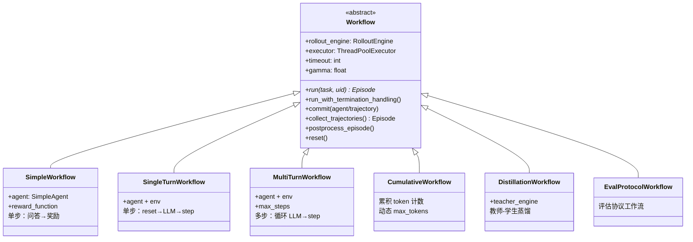

### 3.3.2 五种 Workflow 变体对比

| Workflow | 文件大小 | 适用场景 | 特点 |
|----------|---------|---------|------|
| **SimpleWorkflow** | 68行 | 纯问答（无环境） | 直接 LLM 调用 + 奖励计算 |
| **SingleTurnWorkflow** | 58行 | 单步 Agent-Env | reset → LLM → step → done |
| **MultiTurnWorkflow** | 61行 | 多步 Agent-Env | 循环 max_steps 次 |
| **CumulativeWorkflow** | 72行 | 多步 + token 预算 | 动态计算每步可用 token 数 |
| **DistillationWorkflow** | 79行 | 知识蒸馏 | 学生生成 → 教师计算 logprobs → 蒸馏优势 |

### 3.3.3 Workflow 的后处理管线 (`postprocess_episode`)

```
1. 设置 episode.id 和 episode.task
2. 清理不完整的step（空 chat_completions）
3. compute_trajectory_reward()  — 聚合步级奖励
4. adjust_step_rewards()        — 奖励塑形 + MC 回报
5. assign_episode_correctness() — 总奖励>0 → is_correct=True
6. collect_metrics()            — 按 agent 名聚合指标
7. 存储错误详情
8. 设置终止原因
```

### 3.3.4 TerminationReason 枚举

```python
class TerminationReason(Enum):
    MAX_PROMPT_LENGTH_EXCEEDED     # prompt 过长
    MAX_RESPONSE_LENGTH_EXCEEDED   # response 过长
    ENV_DONE                       # 环境正常结束
    MAX_TURNS_EXCEEDED             # 达到最大步数
    TIMEOUT                        # 超时
    UNKNOWN                        # 未知
    ERROR                          # 运行出错
```

---

## 3.4 训练器系统

### 3.4.1 双训练器架构

rLLM 存在两套训练器，分别位于不同的演化阶段：

| 训练器 | 路径 | 状态 | 支持后端 |
|--------|------|------|----------|
| `AgentTrainer` (旧) | `rllm/trainer/agent_trainer.py` | 稳定版 | verl, fireworks, tinker |
| `UnifiedTrainer` (新) | `rllm/experimental/unified_trainer.py` | 实验版 | verl, tinker |

### 3.4.2 UnifiedTrainer 的 8 阶段训练步

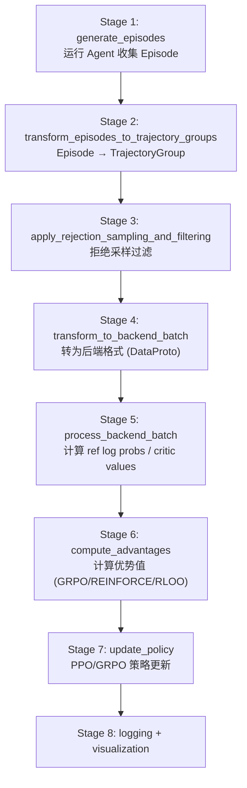

### 3.4.3 BackendProtocol 抽象

`UnifiedTrainer` 通过 `BackendProtocol` 抽象与不同训练后端交互：

```python
class BackendProtocol:
    def init_rollout_engine() -> RolloutEngine
    def validate_config()
    def get_dataloader(dataset, state) -> Iterable
    async def generate_episodes(batch, engine) -> list[Episode]
    def transform_to_backend_batch(state)
    async def process_backend_batch(state)
    async def compute_advantages(state, algorithm_config)
    async def update_policy(state)
    async def on_train_start/end(state)
    async def on_epoch_start/end(state)
    async def on_batch_start/end(state)
    async def on_validation_start/end(state)
```

### 3.4.4 AgentTrainer（旧版，verl 后端路径）

```python
def _train_verl(self):
    ray.init(runtime_env=get_ppo_ray_runtime_env())
    runner = TaskRunner.remote()
    ray.get(runner.run.remote(
        config, workflow_class, workflow_args,
        agent_class, env_class, agent_args, env_args
    ))
```

`TaskRunner` 是一个 Ray Actor，它在 GPU 节点上初始化 verl 的 PPO 训练器。verl 训练器内部通过 `AgentWorkflowEngine.execute_tasks_verl()` 在每个训练步骤中执行 Agent rollout。

---

## 3.5 数据从 Agent 到 GPU 的完整流转

以 verl 后端 + Workflow 模式为例：

```
1. Dataset → DataLoader → batch of tasks (dicts)
2. AgentWorkflowEngine.execute_tasks(tasks)
   ├── 并发 N 个 Workflow.run(task)
   │   ├── Agent + Env 交互循环
   │   ├── RolloutEngine.get_model_response() → ModelOutput
   │   │   └── VerlEngine → vLLM → 返回 token_ids + logprobs
   │   └── commit() → 记录 Trajectory
   └── 返回 list[Episode]
3. transform_results_for_verl(episodes)
   ├── 提取每个 step 的 prompt_ids, completion_ids
   ├── 构建 (input_ids, attention_mask, position_ids)
   ├── 构建 (traj_rewards, step_rewards, response_mask)
   └── 返回 DataProto
4. verl 接管 DataProto
   ├── compute_ref_log_probs (参考模型)
   ├── compute_advantages (GRPO/REINFORCE)
   └── PPO update → 更新模型权重
5. VerlEngine.sleep() → 卸载推理模型
6. 训练完成 → VerlEngine.wake_up() → 加载新权重
7. 回到步骤 1
```
# 第四章：特性支持层详解

本章分析叠加在核心框架之上的各项可选特性，揭示它们如何注入到核心管线中。

---

## 4.1 SDK 集成层 —— "任意 Agent 框架" 的秘密

### 4.1.1 SDK 架构总览

rLLM SDK 的核心理念：**不要求用户修改 Agent 代码**，而是通过拦截 LLM 调用自动收集训练数据。

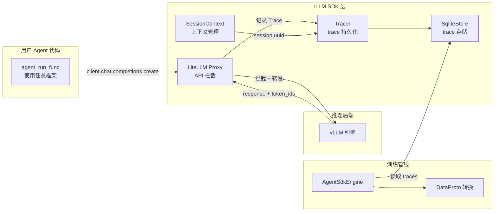

### 4.1.2 五种框架集成

每种集成本质上都是一个**回调/钩子**，在 LLM 调用前后自动记录 Trace：

| 框架 | 集成文件 | 拦截机制 | 代码量 |
|------|---------|---------|--------|
| **OpenAI Agents SDK** | `openai_agents.py` | `RLLMTrajectoryHooks` — `on_llm_start/end` 生命周期钩子 | 21K |
| **Google ADK** | `adk.py` | `RLLMTrajectoryPlugin` — ADK BaseTool 插件 | 18K |
| **LangGraph** | `langgraph.py` | `RLLMCallbackHandler` — LangChain callback 机制 | 14K |
| **SmolAgents** | `smolagents.py` | `RLLMMonitor` — 猴子补丁 `agent.run()` | 13K |
| **Strands Agents** | `strands.py` | `RLLMTrajectoryHookProvider` — Strands hook 接口 | 20K |

### 4.1.3 `@trajectory` 装饰器

SDK 提供的最简单使用方式：

```python
@trajectory(name="solver")
async def solve(problem: str):
    response = await client.chat.completions.create(...)
    return response.choices[0].message.content

traj = await solve("What is 2+2?")
# traj.steps = [Step(...)]  — 每个 LLM 调用自动变为一个 Step
# 用户手动设置 traj.steps[0].reward = 1.0
```

**实现原理**（[decorators.py](file:///home/robomaster/Research/rllm/rllm/sdk/decorators.py)）：
1. 装饰器创建 `session` 上下文
2. 用户函数执行，所有 LLM 调用被 session 捕获为 `Trace`
3. 函数返回后，每个 `Trace` 通过 `trace_to_step()` 转为 `Step`
4. 构建 `Trajectory(steps=steps, reward=0.0)`

### 4.1.4 Session 与 Tracer 系统

```
SessionContext (上下文管理器)
├── ContextVarSession (基于 contextvars)
│   └── 追踪 thread/coroutine 内的所有 LLM 调用
├── SessionBuffer (内存缓冲)
│   └── 临时存储 trace 数据
└── Tracer (持久化)
    ├── InMemorySessionTracer (内存)
    └── SqliteTracer (SQLite 数据库)
```

---

## 4.2 蒸馏训练 (On-Policy Distillation)

### 4.2.1 原理

蒸馏训练使用一个强模型（教师）来指导弱模型（学生）学习：

```
学生生成 response → 教师计算该 response 的 logprobs → 
per-token advantage = teacher_logprob - student_logprob
```

### 4.2.2 实现路径

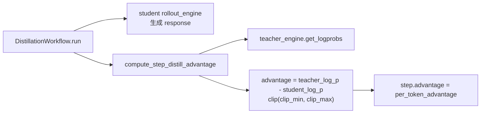

**关键代码**（`rllm/trainer/distill/`）：
- 支持 **shared_tokenizer**（相同 tokenizer 时直接比较 logprobs）和 **不同 tokenizer**（需要 token 对齐）
- 可配置 `clip_min`/`clip_max` 防止极端优势值

### 4.2.3 影响的核心框架部分

| 核心组件 | 影响 |
|---------|------|
| `Workflow` | 新增 `DistillationWorkflow` 子类 |
| `Step.advantage` | 从 scalar 变为 `list[float]`（per-token） |
| `RolloutEngine` | 需要两个实例：student + teacher |
| 优势计算 | 使用预计算的 advantage，跳过 GRPO 等算法 |

---

## 4.3 拒绝采样与 Compact Filtering

### 4.3.1 拒绝采样 (Rejection Sampling)

```python
class RejectionSamplingConfig:
    mode: str  # "episode" | "none"
    min_partial_solve_tasks: int   # 至少需要部分成功的任务数
    min_trajs_per_group: int       # 每组至少需要的轨迹数
```

**作用**：过滤掉所有 rollout 全部失败或全部成功的 task（这些 task 对梯度贡献不大），只保留"部分成功"的 task，从而提高训练效率。

### 4.3.2 Compact Filtering（按终止原因过滤）

根据 `TerminationReason` 过滤 episode：

```python
class CompactFilteringConfig:
    enable: bool
    mask_max_prompt_length_exceeded: bool   # 过滤 prompt 过长
    mask_max_response_length_exceeded: bool # 过滤 response 过长
    mask_env_done: bool                     # 过滤环境正常结束（可选）
    mask_max_turns_exceeded: bool           # 过滤超过最大步数
    mask_timeout: bool                      # 过滤超时
    mask_unknown: bool                      # 过滤未知终止
    mask_error: bool                        # 过滤错误终止
```

**影响点**：设置 `is_valid=False` 标志，在 verl 训练时跳过这些样本，不计算 loss。

---

## 4.4 VLM 多模态支持

### 4.4.1 实现路径

```
1. 数据层: transforms 函数处理 images 字段 (base64/URL/PIL)
2. 解析器: QwenChatTemplateParser.parse_user 处理 <image> token
   → vision_start + image_pad + vision_end
3. 解析器: process_image_data() 使用 qwen_vl_utils.fetch_image
4. RolloutEngine: 将 multi_modal_inputs 传入 vLLM
5. 训练器: compute_vl_position_ids() 处理 mrope 位置编码
```

### 4.4.2 影响的核心框架

| 组件 | 变化 |
|------|------|
| `ModelOutput` | 新增 `multi_modal_inputs` 字段 |
| `ChatTemplateParser` | 新增 `processor` 参数和图像处理方法 |
| `transform_results_for_verl` | 新增 mrope position_ids 计算 |
| 数据 transforms | 30% 的 transform 包含 images 处理 |

---

## 4.5 全异步训练

### 4.5.1 设计目标

传统训练流程是 **同步的** — 推理完成后才能训练，训练完成后才能推理。全异步训练将推理和训练**完全并行化**。

### 4.5.2 `fully_async/` 模块结构

| 文件 | 职责 |
|------|------|
| `fully_async_trainer.py` | 全异步训练主循环 (33K) |
| `message_queue.py` | 训练/推理之间的消息队列 |
| `param_sync.py` | GPU 间的参数同步 |
| `inference_manager.py` | 独立推理管理器 |
| `rollout_executor.py` | 异步 rollout 执行器 |
| `runner.py` | 分布式运行器 |

### 4.5.3 核心思想

```
推理进程 ────── 生成 batch N   ─── 生成 batch N+1 ─── ...
                    │ (异步发送)        │
训练进程 ────── 训练 batch N-1 ─── 训练 batch N   ─── ...
                                    │ (参数同步)
```

> **影响**：推理引擎不再执行 wake_up/sleep，而是持续运行在独立 GPU 上。参数通过 `param_sync` 模块从训练 GPU 异步同步到推理 GPU。

---

## 4.6 CLI 工具

`rllm/experimental/cli/` 提供命令行界面：

```bash
rllm eval --model gpt-4 --dataset gsm8k --workflow simple
rllm train --config config.yaml
```

**影响点**：CLI 是 `AgentTrainer` 和 `UnifiedTrainer` 的前端入口，通过 Hydra 配置管理。

---

## 4.7 遥测系统 (rllm_telemetry)

基于 OpenTelemetry 的 LLM 调用追踪：
- 记录每个 LLM 调用的 latency、token 数、cost
- 支持导出到各种后端（Jaeger、Grafana 等）
- 集成到 SDK 的 session 体系中

---

## 4.8 特性影响总结

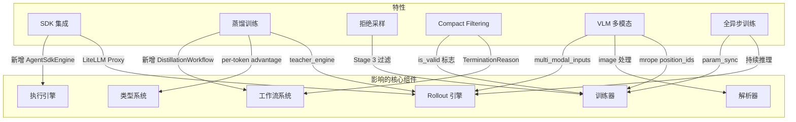
# 第五章：外部框架集成与分布式架构

本章揭示 rLLM 如何与 verl、vLLM、Ray 等外部框架深度耦合，以及分布式训练的完整运作机制。

---

## 5.1 rLLM + verl 集成架构

### 5.1.1 verl 是什么

verl（Versatile Easy-to-use Reinforcement Learning for LLMs）是一个分布式 RLHF/RL 训练框架，提供：
- FSDP（Fully Sharded Data Parallel）进行策略模型训练
- vLLM 进行高吞吐推理
- Ray 进行分布式任务调度
- `DataProto` 作为跨模块的数据传输格式

### 5.1.2 集成层次

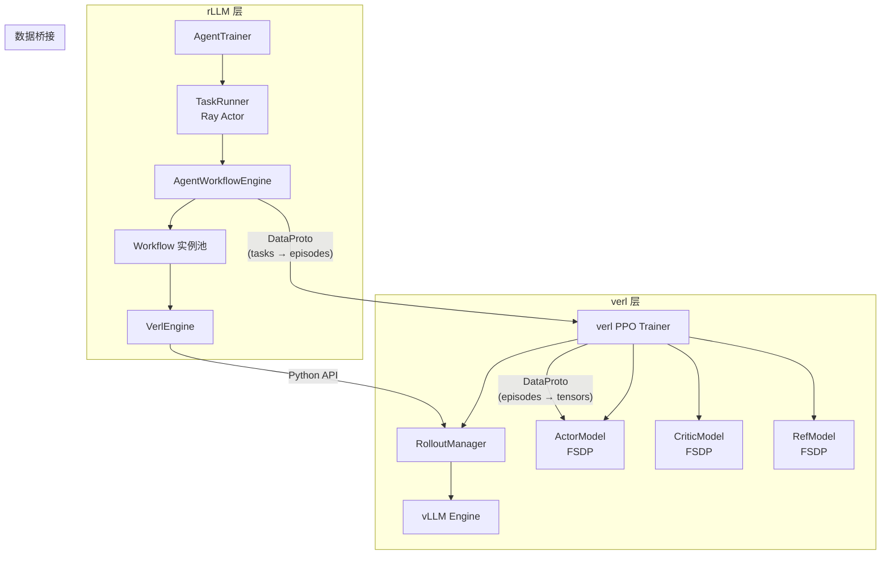

### 5.1.3 rLLM-verl 数据流

```
verl PPO Trainer 每个训练步：
  1. 从 DataLoader 取出一批 tasks
  2. 调用 rLLM 的 AgentWorkflowEngine.execute_tasks_verl(batch)
     a. VerlEngine.wake_up() — 将模型权重加载到 GPU
     b. 并发执行 N 个 Workflow.run()
        - Workflow 内部调用 VerlEngine.get_model_response()
        - VerlEngine 直接调用 verl 的 rollout_manager.generate()
     c. VerlEngine.sleep() — 卸载推理模型，释放显存
     d. transform_results_for_verl() — Episode → DataProto
  3. verl 使用 DataProto 进行：
     a. 参考模型前向（计算 ref log probs）
     b. Critic 前向（计算 value estimates）
     c. 计算 GAE/GRPO 优势
     d. PPO/GRPO 策略梯度更新
  4. 保存 checkpoint
  5. 回到步骤 1
```

### 5.1.4 `DataProto` 桥接细节

`transform_results_for_verl()` 构建的 DataProto 包含：

| 字段类别 | 字段名 | 形状 | 说明 |
|---------|--------|------|------|
| **Tensor** | `input_ids` | `[B, P+R]` | prompt + response 拼接 |
| | `attention_mask` | `[B, P+R]` | 有效 token 标记 |
| | `position_ids` | `[B, P+R]` | 位置编码 |
| | `prompts` | `[B, P]` | prompt 部分（左 pad） |
| | `responses` | `[B, R]` | response 部分（右 pad） |
| | `response_mask` | `[B, R]` | 对哪些 response token 计算 loss |
| | `traj_rewards` | `[B, R]` | 轨迹奖励（置于最后一个 token） |
| | `step_rewards` | `[B, R]` | 步级奖励 |
| | `rollout_log_probs` | `[B, R]` | rollout 时的 log probs |
| **Non-tensor** | `episode_ids` | `[B]` | "task_id:rollout_idx:retry" |
| | `trajectory_ids` | `[B]` | "task_id_traj_name" |
| | `step_ids` | `[B]` | "task_id_traj_name_step{i}" |
| | `is_correct` | `[B]` | 是否正确 |
| | `termination_reasons` | `[B]` | 终止原因 |
| | `is_valid` | `[B]` | compact filtering 标志 |
| | `is_last_step` | `[B]` | 是否为该 trajectory 的最后一步 |
| **Meta** | `repeat_counts` | `list` | 每个 episode 贡献的步数 |

> **注意**：`repeat_counts` 是关键元数据——rLLM 支持每个 episode 包含多个 trajectory、每个 trajectory 包含多个 step，verl 需要知道哪些行属于同一 episode 以正确计算组内优势。

---

## 5.2 GPU 显存共享机制（wake_up / sleep）

这是 verl 架构的**核心优化**。在单节点 8-GPU 场景下：

```
训练阶段 (FSDP):           推理阶段 (vLLM):
GPU 0: actor_shard_0        GPU 0: vllm_replica_0
GPU 1: actor_shard_1        GPU 1: vllm_replica_1
GPU 2: actor_shard_2        GPU 2: vllm_replica_2
GPU 3: actor_shard_3        GPU 3: vllm_replica_3
GPU 4: critic_shard_0       GPU 4: (空闲)
GPU 5: critic_shard_1       GPU 5: (空闲)
GPU 6: critic_shard_2       GPU 6: (空闲)
GPU 7: critic_shard_3       GPU 7: (空闲)
```

**交替流程**：
1. `wake_up()`: vLLM 引擎将权重从 CPU/磁盘加载到 GPU，开始推理
2. Agent rollout 在 vLLM 上生成 response
3. `sleep()`: vLLM 将权重卸载到 CPU，释放 GPU
4. FSDP 将 actor/critic 权重分片加载到 GPU 进行训练
5. 训练完成，将更新后的权重保存
6. 回到步骤 1，vLLM 加载新权重

> 这避免了需要两套 GPU 分别用于训练和推理的开销。

---

## 5.3 Ray 分布式编排

### 5.3.1 rLLM 中的 Ray 使用

rLLM 通过 Ray 启动分布式训练任务：

```python
# rllm/trainer/agent_trainer.py
def _train_verl(self):
    ray.init(runtime_env=get_ppo_ray_runtime_env())
    runner = TaskRunner.remote()   # Ray Actor
    ray.get(runner.run.remote(...))
```

### 5.3.2 verl 后端的 Ray 角色

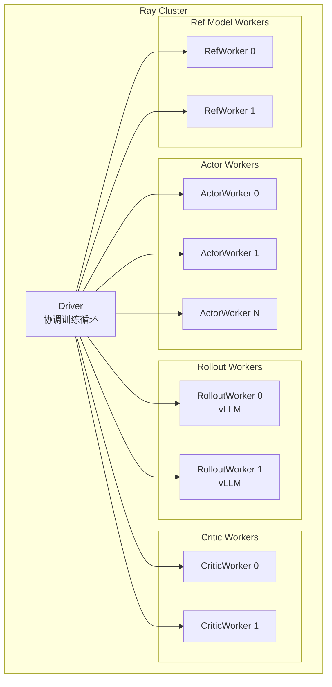

> 在 co-located 模式下，Actor/Rollout/Critic 可在同一组 GPU 上交替运行，通过 wake_up/sleep 切换。

---

## 5.4 其他外部框架集成

### 5.4.1 HuggingFace (Transformers + Datasets)

| 用途 | 具体使用 |
|------|---------|
| **Tokenizer** | `AutoTokenizer.from_pretrained()` — 所有 Chat 解析器的基础 |
| **模型加载** | 通过 verl/vLLM 间接使用 HF 模型 |
| **数据集** | `datasets.load_dataset()` — 加载 50+ 公开数据集 |
| **Chat Template** | `tokenizer.apply_chat_template()` — ChatTemplateParser 的基础实现 |

### 5.4.2 LiteLLM

在 SDK 模式下：
1. **API Proxy** — 在用户的 Agent 代码和 vLLM 之间插入代理层
2. **Trace 收集** — 记录每次 API 调用的完整请求/响应
3. **配置管理** — `VerlProxyManager` 动态注册/注销 vLLM 副本

### 5.4.3 Tinker

轻量级训练后端，适合单机开发：
- Python callable 推理（不需要 GPU）
- 支持完整的 RL 训练循环
- 通过 `TinkerEngine` 适配器接入

---

## 5.5 分布式训练全景图

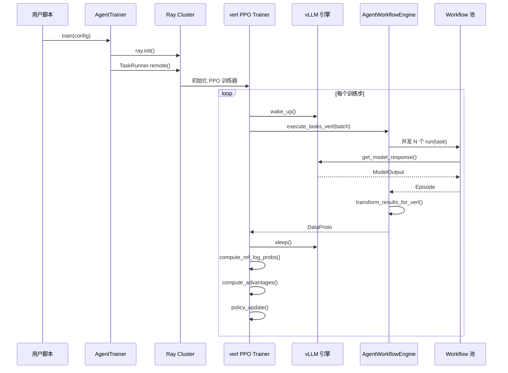

---

# 第六章：总结与设计哲学

## 6.1 rLLM 的核心设计原则

| 原则 | 体现 |
|------|------|
| **框架无关** | 通过 SDK 拦截层支持任意 Agent 框架 |
| **渐进式复杂度** | SimpleWorkflow → MultiTurnWorkflow → 自定义 Workflow |
| **后端抽象** | BackendProtocol 隔离训练后端差异 |
| **异步优先** | 所有执行引擎基于 asyncio |
| **可组合** | 奖励函数、工作流、环境均可独立替换 |
| **显存高效** | wake_up/sleep 机制实现 GPU 时分复用 |

## 6.2 三层架构的价值

1. **基础层** 提供不变的抽象（Step/Trajectory/Episode），确保上层组件可独立演化
2. **核心层** 提供三种执行模式，覆盖从简单到复杂的所有使用场景
3. **特性层** 以插件方式叠加，不破坏核心管线的简洁性

## 6.3 与同类框架的定位区别

| | rLLM | TRL | verl (单独) | OpenRLHF |
|--|------|-----|-----------|----------|
| Agent 支持 | ✅ 多步多轮 | ❌ 主要单步 | ❌ 需自行实现 | ❌ 主要单步 |
| 框架集成 | ✅ 5+ 框架 | ❌ | ❌ | ❌ |
| 环境交互 | ✅ 完整环境系统 | ❌ | ❌ | ❌ |
| 分布式训练 | ✅ (verl backend) | 部分 | ✅ | ✅ |
| 工具使用 | ✅ 完整工具系统 | ❌ | ❌ | ❌ |
| 蒸馏支持 | ✅ | ❌ | ❌ | ❌ |
