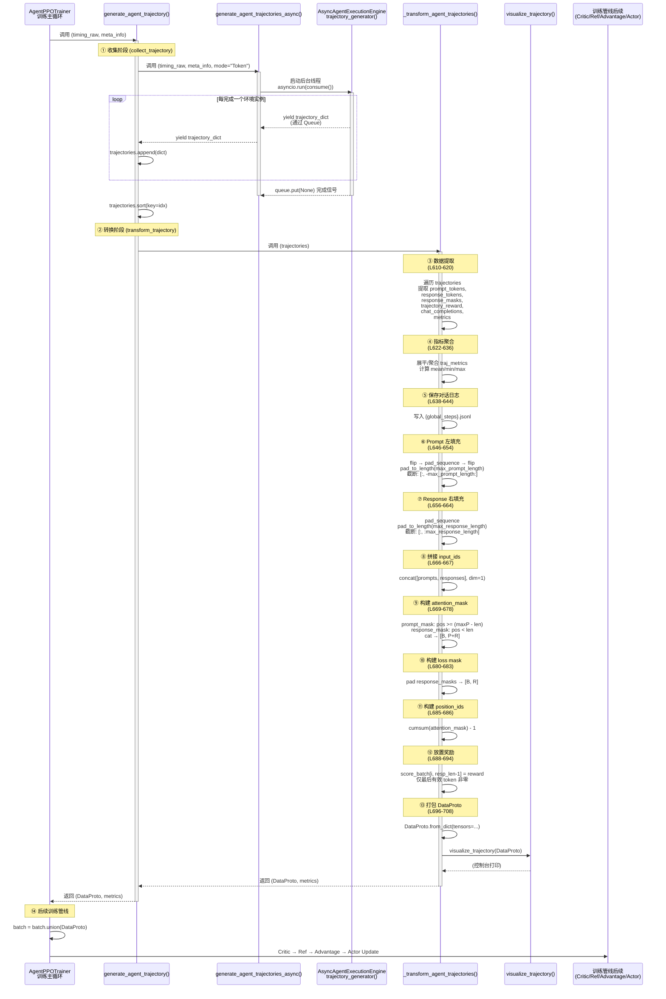

# AgentPPOTrainer._transform_agent_trajectories 详解

本页详细分析 `AgentPPOTrainer._transform_agent_trajectories()` 方法的功能、内部计算流程和数据流向。该方法是 **原始轨迹数据 → 训练就绪 DataProto 张量** 的核心转换桥梁。

> 源码参考：[rllm/trainer/verl/agent_ppo_trainer.py L590-708](../rllm/trainer/verl/agent_ppo_trainer.py)

---

## 1. 功能概述

`_transform_agent_trajectories()` 是 `AgentPPOTrainer` 的内部方法，负责将 `AgentExecutionEngine` 生成的**原始轨迹字典列表**转换为 verl 训练管线所需的 **`DataProto` 张量格式**。

### 输入

```python
trajectories: list[dict]
# 每个 dict 包含:
{
    "idx":                int,           # 轨迹在 batch 中的原始索引
    "prompt_tokens":      Tensor[P],     # prompt token IDs
    "response_tokens":    Tensor[R],     # response token IDs（变长）
    "response_masks":     Tensor[R],     # loss mask（1=计算loss, 0=跳过）
    "trajectory_reward":  float,         # 整条轨迹的标量奖励
    "chat_completions":   list[dict],    # 完整对话历史（用于日志）
    "metrics":            dict,          # 轨迹级指标（steps, llm_time等）
}
```

### 输出

```python
(DataProto, dict)
# DataProto.batch 包含:
{
    "input_ids":          Tensor[B, P+R],   # prompt + response 拼接
    "attention_mask":     Tensor[B, P+R],   # 有效 token 标记
    "position_ids":       Tensor[B, P+R],   # 位置编码
    "prompts":            Tensor[B, P],     # 纯 prompt（左填充）
    "responses":          Tensor[B, R],     # 纯 response（右填充）
    "token_level_scores": Tensor[B, R],     # 奖励（仅最后 token 非零）
    "response_mask":      Tensor[B, R],     # loss mask
}
# dict: 聚合后的 trajectory 指标
```

---

## 2. 时序图



---

## 3. 逐步计算流程

### 阶段 ①：数据提取 (L610-620)

遍历每个 trajectory dict，提取六类数据到并行列表：

```python
for traj in trajectories:
    all_initial_tokens_list.append(traj["prompt_tokens"])     # Tensor[P_i]
    all_response_tokens_list.append(traj["response_tokens"])  # Tensor[R_i]
    all_masks_list.append(traj["response_masks"])             # Tensor[R_i]
    traj_scores.append(traj["trajectory_reward"])             # float
    chat_completions.append(traj["chat_completions"])         # list[dict]
    traj_metrics.append(traj["metrics"])                      # dict
```

> **关键**：每条轨迹的 prompt 和 response 长度 *可能不同*（变长序列），后续需要 padding 对齐。

### 阶段 ②：指标聚合 (L622-636)

```python
# 展平: [{k1: v1, k2: v2}, {k1: v3, k2: v4}]
#     → {k1: [v1, v3], k2: [v2, v4]}
traj_metrics = {k: [d[k] for d in traj_metrics] for k in traj_metrics[0]}

# 聚合为 mean/min/max
for k, v_list in traj_metrics.items():
    v_list = [v for v in v_list if v is not None and v >= 0]
    metrics[f"traj/{k}_mean"] = v_list.mean()
    metrics[f"traj/{k}_min"]  = v_list.min()
    metrics[f"traj/{k}_max"]  = v_list.max()
```

典型指标键：`num_steps`、`llm_time`、`env_time`、`total_time`。

### 阶段 ③：对话日志保存 (L638-644)

```python
save_dir = os.path.join(config.trainer.default_local_dir, "chat_completions")
with open(f"{save_dir}/{global_steps}.jsonl", "w") as f:
    for cc in chat_completions:
        f.write(json.dumps(cc) + "\n")
```

> 每个训练步保存一个 JSONL 文件，用于事后分析和调试。

### 阶段 ④：Prompt 左填充 (L646-654)

**目的**：将变长 prompt 对齐到固定长度 `max_prompt_length`，使用 `pad_token_id` 在**左侧**填充。

```python
# 1. flip → pad_sequence → flip（实现左填充）
prompts_batch = pad_sequence(
    [flip(tokens) for tokens in all_initial_tokens_list],
    batch_first=True,
    padding_value=pad_token_id,
).flip(dims=[1])

# 2. 确保至少 max_prompt_length 长
prompts_batch = pad_sequence_to_length(
    prompts_batch, max_prompt_length, pad_token_id, left_pad=True
)

# 3. 截断超长 prompt（取最后 max_prompt_length 个 token）
prompts_batch = prompts_batch[:, -max_prompt_length:]
```

**数据变化示例**（`max_prompt_length=6`，`pad_token_id=0`）：

```
输入:  [[101, 202],           [101, 202, 303, 404]]
flip:  [[202, 101],           [404, 303, 202, 101]]
pad:   [[202, 101, 0, 0],     [404, 303, 202, 101]]
flip:  [[0, 0, 101, 202],     [101, 202, 303, 404]]
padL:  [[0, 0, 0, 0, 101, 202], [0, 0, 101, 202, 303, 404]]
```

### 阶段 ⑤：Response 右填充 (L656-664)

```python
# 1. 标准右填充
response_batch = pad_sequence(
    all_response_tokens_list, batch_first=True,
    padding_value=pad_token_id,
)

# 2. 确保至少 max_response_length 长
response_batch = pad_sequence_to_length(
    response_batch, max_response_length, pad_token_id, left_pad=False
)

# 3. 截断超长 response
response_batch = response_batch[:, :max_response_length]
```

### 阶段 ⑥：拼接 input_ids (L666-667)

```python
trajectory_batch = torch.concat([prompts_batch, response_batch], dim=1)
# shape: [B, max_prompt_length + max_response_length]
```

### 阶段 ⑦：构建 Attention Mask (L669-678)

```python
# Prompt mask（左填充 → 右对齐）
prompt_lengths = [len(t) for t in all_initial_tokens_list]  # 原始长度
prompt_mask = arange(maxP) >= (maxP - prompt_lengths)       # 右侧为 True

# Response mask（右填充 → 左对齐）
response_lengths = [len(t) for t in all_response_tokens_list]
response_mask = arange(maxR) < response_lengths              # 左侧为 True

# 拼接
attention_mask = cat([prompt_mask, response_mask], dim=1).long()  # [B, P+R]
```

**示例**（P=6, R=4, prompt_len=2, response_len=3）：

```
prompt_mask:    [0, 0, 0, 0, 1, 1]
response_mask:  [1, 1, 1, 0]
attention_mask: [0, 0, 0, 0, 1, 1, 1, 1, 1, 0]
```

### 阶段 ⑧：构建 Loss Mask (L680-683)

```python
traj_mask = pad_sequence(all_masks_list, batch_first=True, padding_value=0)
traj_mask = pad_sequence_to_length(traj_mask, max_response_length, 0, left_pad=False)
traj_mask = traj_mask[:, :max_response_length]  # [B, R]
```

> `response_masks` 来自 `AgentExecutionEngine`（或 `ChatTemplateParser`），标记哪些 response token 是 assistant 生成的（=1，计算 loss）、哪些是环境/用户 token（=0，不计算 loss）。

### 阶段 ⑨：构建 Position IDs (L685-686)

```python
position_ids = (cumsum(attention_mask, dim=1) - 1) * attention_mask
```

**示例**：

```
attention_mask: [0, 0, 0, 0, 1, 1, 1, 1, 1, 0]
cumsum:         [0, 0, 0, 0, 1, 2, 3, 4, 5, 5]
cumsum - 1:     [-1,-1,-1,-1,0, 1, 2, 3, 4, 4]
× mask:         [0, 0, 0, 0, 0, 1, 2, 3, 4, 0]
```

### 阶段 ⑩：奖励放置 (L688-694)

**关键设计**：奖励值被放在每条轨迹 response 的 **最后一个有效 token** 位置。

```python
score_batch = zeros_like(response_batch, dtype=float32)  # [B, R] 全零

for i, score in enumerate(traj_scores):
    resp_len = response_lengths[i]
    if resp_len > 0 and resp_len <= R:
        score_batch[i, resp_len - 1] = score  # 最后一个有效 token
```

**示例**（response_len=3, reward=0.8）：

```
score_batch: [0.0, 0.0, 0.8, 0.0, 0.0, ...]
                          ↑ 最后有效 token
```

> **为什么放在最后 token**？GRPO/REINFORCE 等算法从此位置提取标量奖励进行优势归一化，放在最后 token 是 verl 训练管线的约定。

### 阶段 ⑪：打包 DataProto (L696-708)

```python
tensor_batch = {
    "input_ids":          trajectory_batch,    # [B, P+R]
    "attention_mask":     attention_mask,       # [B, P+R]
    "position_ids":       position_ids,         # [B, P+R]
    "responses":          response_batch,       # [B, R]
    "prompts":            prompts_batch,        # [B, P]
    "token_level_scores": score_batch,          # [B, R]
    "response_mask":      traj_mask,            # [B, R]
}

self.visualize_trajectory(DataProto.from_dict(tensors=tensor_batch))
return DataProto.from_dict(tensors=tensor_batch), metrics
```

---

## 4. 调用上下文

### 在训练主循环中的位置

```python
# agent_ppo_trainer.py L533-563
def generate_agent_trajectory(self, timing_raw, meta_info):
    # ① 异步收集轨迹
    with marked_timer("collect_trajectory", timing_raw):
        trajectories = []
        gen = self.generate_agent_trajectories_async(
            timing_raw=timing_raw, meta_info=meta_info, mode="Token"
        )
        for trajectory in gen:
            trajectories.append(trajectory)

    # ② 按 idx 排序（异步生成可能乱序）
    trajectories.sort(key=lambda x: x["idx"])

    # ③ 调用 _transform_agent_trajectories
    with marked_timer("transform_trajectory", timing_raw):
        final_gen_batch_output, metrics = self._transform_agent_trajectories(trajectories)

    return final_gen_batch_output, metrics
```

### 后续管线

```
_transform_agent_trajectories()
    ↓ DataProto
batch = batch.union(DataProto)          # 合并到主 batch
    ↓
Critic.compute_values(batch)            # 计算价值估计
    ↓
reward_fn(batch) → token_level_scores   # 或使用已有 scores
    ↓
Rejection Sampling                      # 过滤全对/全错组
    ↓
Actor.compute_log_prob(batch)           # 计算旧 log prob
    ↓
Ref.compute_ref_log_prob(batch)         # 计算参考 log prob
    ↓
compute_advantage()                     # GRPO/REINFORCE/RLOO
    ↓
Actor.update_actor(batch)               # PPO 策略更新
```

---

## 5. 与 _transform_agent_steps 的对比

| 维度 | `_transform_agent_trajectories` | `_transform_agent_steps` |
|------|-------------------------------|-------------------------|
| **粒度** | 每 trajectory → 1 行 DataProto | 每 step → 1 行 DataProto |
| **使用场景** | `stepwise_advantage.enable=False` | `stepwise_advantage.enable=True` |
| **调用方** | `generate_agent_trajectory()` | `generate_agent_steps()` |
| **输入格式** | `{"prompt_tokens", "response_tokens", ...}` | `{"steps": [{"prompt", "response"}, ...]}` |
| **Tokenization** | 已有 token IDs（来自引擎） | 重新 `tokenizer.encode()` |
| **奖励** | `trajectory_reward` → 最后 token | `trajectory_reward` broadcast + `mc_returns` |
| **额外输出** | 无 | `is_last_step`, `step_ids`, `mc_returns`, `repeat_counts` |
| **Overlong Filter** | ❌ 不支持 | ✅ `response_mask` 全零化 |

---

## 6. 关键设计细节

### 为什么 Prompt 左填充、Response 右填充？

```
左填充 Prompt:  [ PAD PAD PAD  tok1 tok2 tok3 ]
右填充 Response:[ tok4 tok5 tok6 PAD  PAD  PAD  ]
拼接:           [ PAD PAD PAD tok1 tok2 tok3 tok4 tok5 tok6 PAD PAD PAD ]
                                    ↑ prompt 与 response 交界处无 PAD 间隔
```

> 确保 prompt 的最后一个 token 与 response 的第一个 token 物理相邻，保持因果注意力的连续性。

### 为什么奖励放在最后有效 token？

GRPO 优势计算需要从 `token_level_scores` 中提取标量奖励（`sum(dim=-1)`）。放在最后 token 等价于整条 response 获得该奖励。

### chat_completions 保存

每个训练步写入 JSONL 日志，格式：

```jsonl
[{"role":"system","content":"..."},{"role":"user","content":"..."},{"role":"assistant","content":"..."}]
[{"role":"system","content":"..."},{"role":"user","content":"..."},{"role":"assistant","content":"..."}]
```

用于事后分析 Agent 行为、调试奖励计算。
