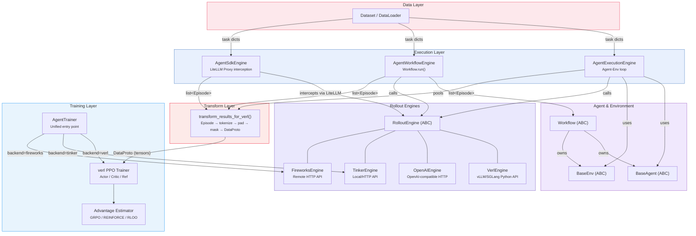
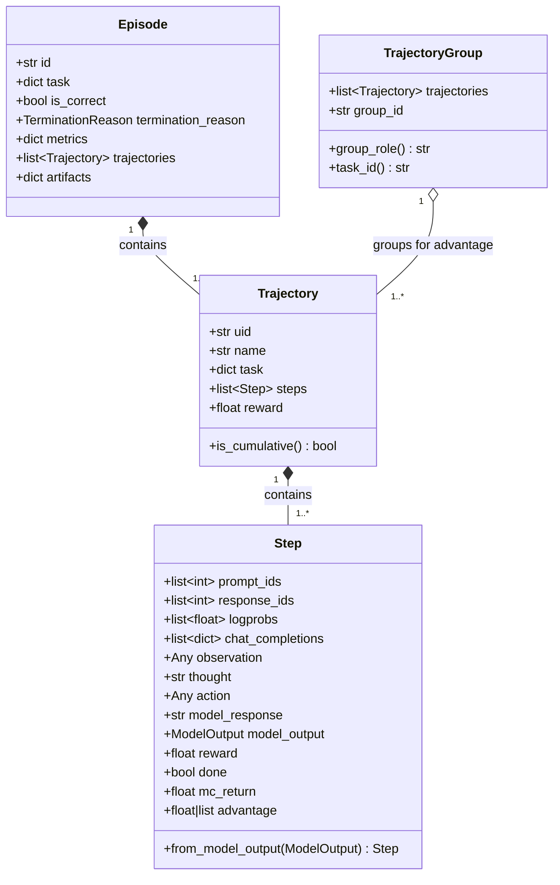
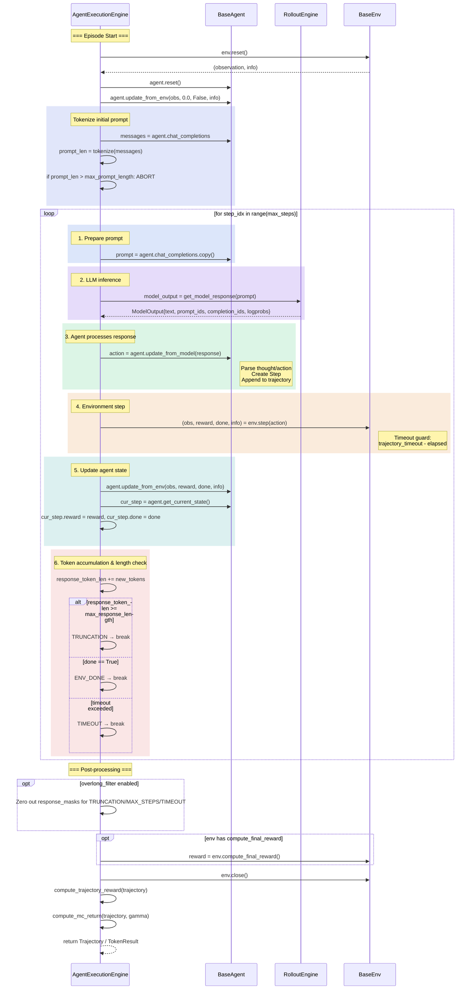
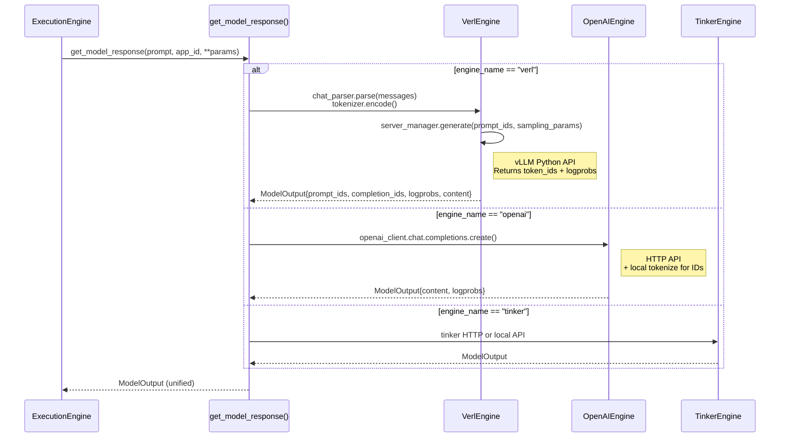
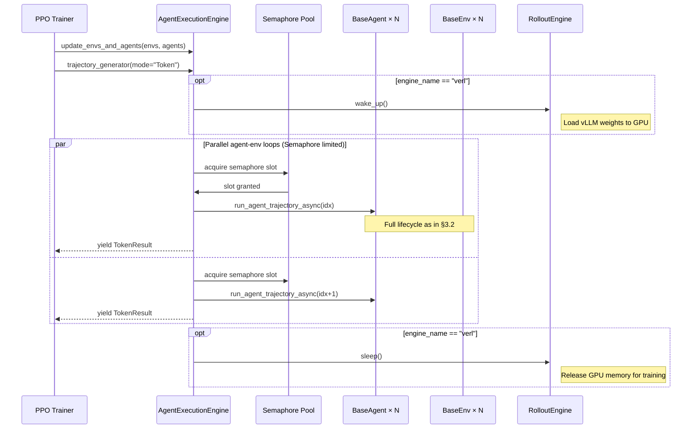
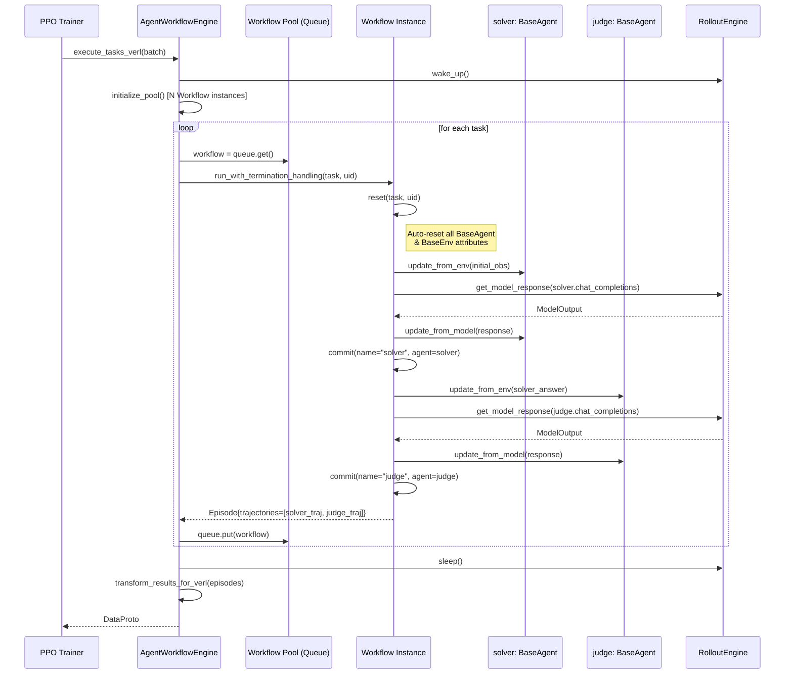
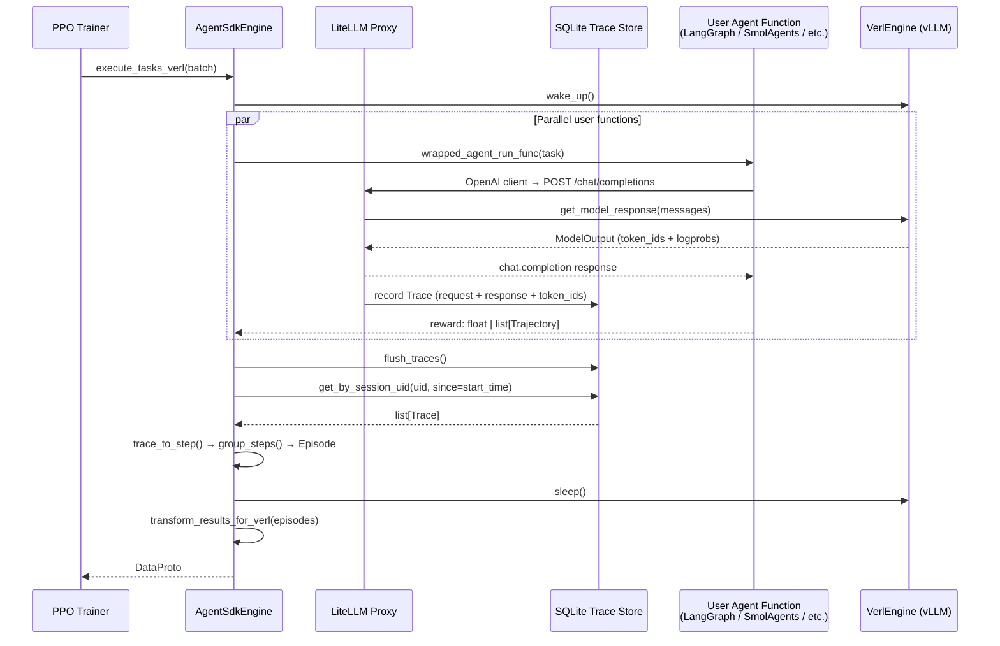
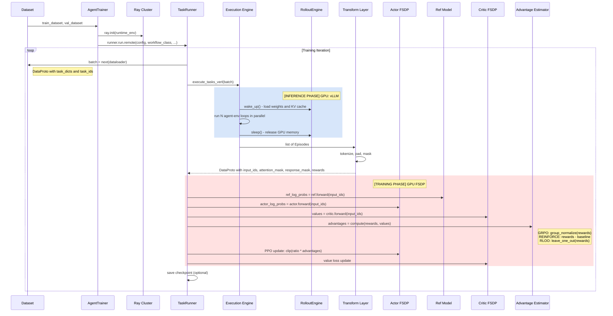
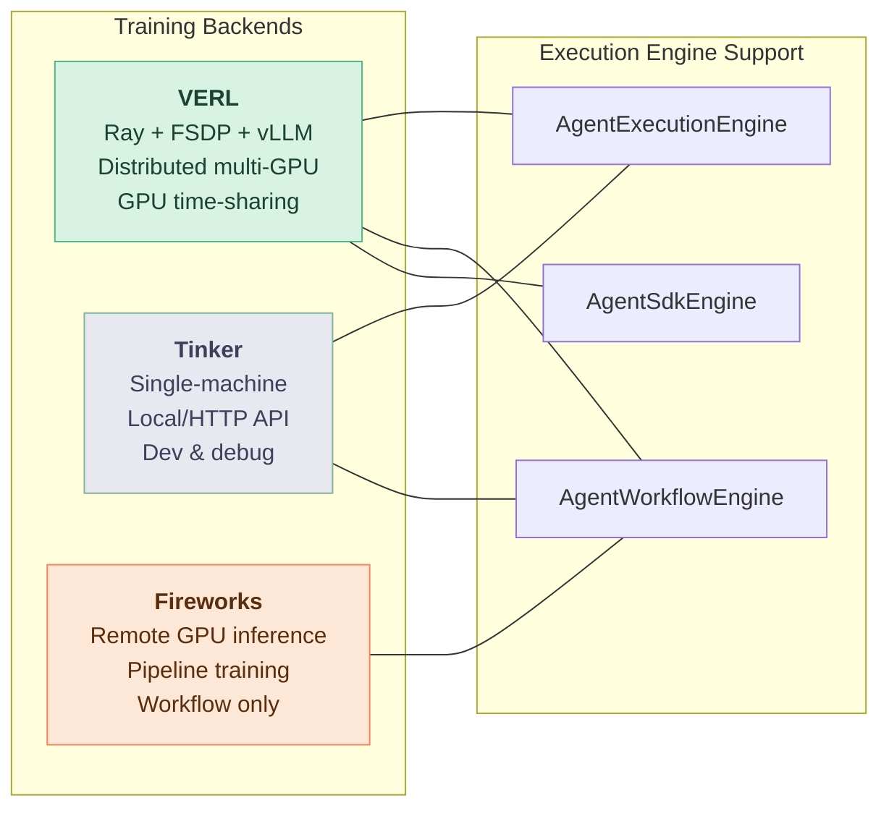
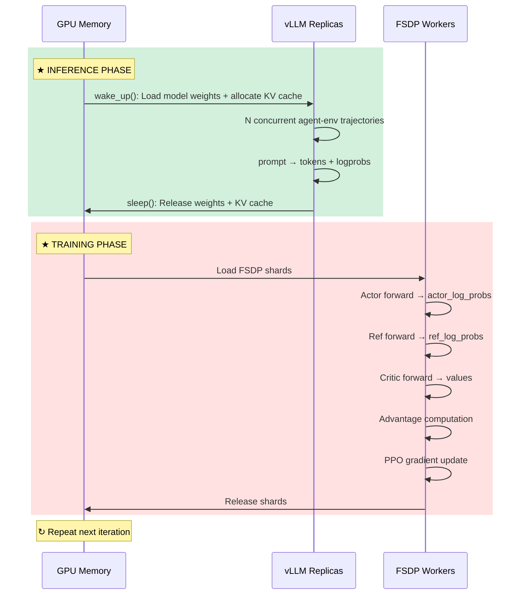

# rLLM Framework Architecture — Component Structure, Data Flow & Agent Internals

## 1. High-Level Component Relationship



### Critical Path (Training Loop)

```
Dataset → AgentWorkflowEngine.execute_tasks_verl()
       → wake_up() → Workflow.run() × N (parallel) → sleep()
       → transform_results_for_verl() → DataProto
       → Critic forward → Ref forward → Advantage → PPO update
       → checkpoint → next iteration
```

---

## 2. Type System: Step → Trajectory → Episode



---

## 3. Agent Architecture Detail

### 3.1 BaseAgent Interface & Concrete Implementations


**AgentHub** (external agent integrations in `agenthub/`):

| Agent | Framework | Integration Mode |
|-------|-----------|-----------------|
| `react_agent` | Native rLLM | Agent/Env or Workflow |
| `langgraph_agent` | LangGraph | SDK Engine (LiteLLM Proxy) |
| `smolagents_agent` | SmolAgents | SDK Engine |
| `strands_agent` | Strands | SDK Engine |
| `swe_agent` | SWE-Agent | Agent/Env |
| `frozenlake_agent` | Classic RL | Agent/Env |
| `terminal_agent` | Terminal | Agent/Env |

### 3.2 BaseAgent Lifecycle — Sequence Diagram



### 3.3 Rollout Backend Dispatch



---

## 4. Execution Engine Comparison — Sequence Diagrams

### 4.1 AgentExecutionEngine (Agent-Env Loop)



### 4.2 AgentWorkflowEngine (Custom Workflow)



### 4.3 AgentSdkEngine (Framework-Agnostic)



---

## 5. End-to-End Training Data Flow



---

## 6. Workflow System — Structure & Variants


---

## 7. Backend Architecture & Selection



| Dimension | VERL | Tinker | Fireworks |
|-----------|------|--------|-----------|
| **Inference** | vLLM/SGLang Python API | Local/HTTP | Remote HTTP |
| **Training** | FSDP distributed | Single-GPU gradient | Pipeline remote |
| **GPU sharing** | ✅ wake_up/sleep | N/A | N/A |
| **Distributed** | ✅ Ray | ❌ | ❌ |
| **VLM support** | ✅ Qwen2VL/3VL | Partial | ❌ |
| **Agent/Env mode** | ✅ | ✅ | ❌ |
| **Workflow mode** | ✅ | ✅ | ✅ (only) |
| **SDK mode** | ✅ | ❌ | ❌ |
| **Best for** | Production training | Development/debug | Remote inference |

---

## 8. GPU Time-Sharing Mechanism (VERL Critical Path)


