# rLLM Framework Architecture — Component Structure, Data Flow & Agent Internals

## 1. High-Level Component Relationship

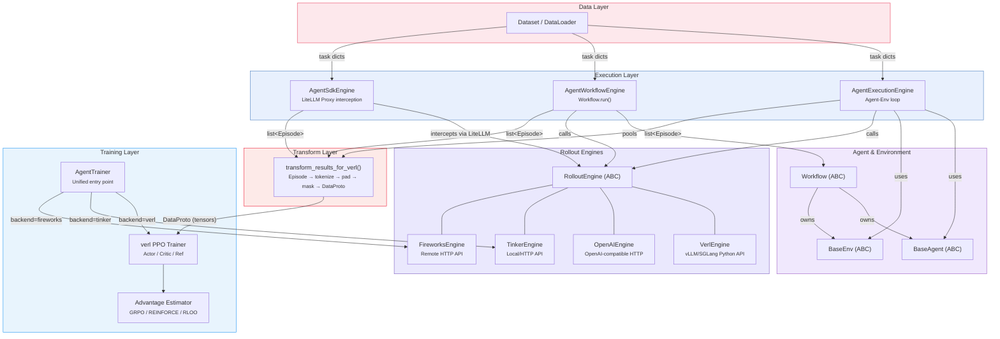

### Critical Path (Training Loop)

```
Dataset → AgentWorkflowEngine.execute_tasks_verl()
       → wake_up() → Workflow.run() × N (parallel) → sleep()
       → transform_results_for_verl() → DataProto
       → Critic forward → Ref forward → Advantage → PPO update
       → checkpoint → next iteration
```

---

## 2. Type System: Step → Trajectory → Episode

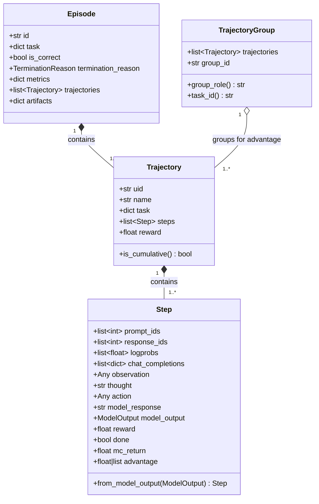

---

## 3. Agent Architecture Detail

### 3.1 BaseAgent Interface & Concrete Implementations

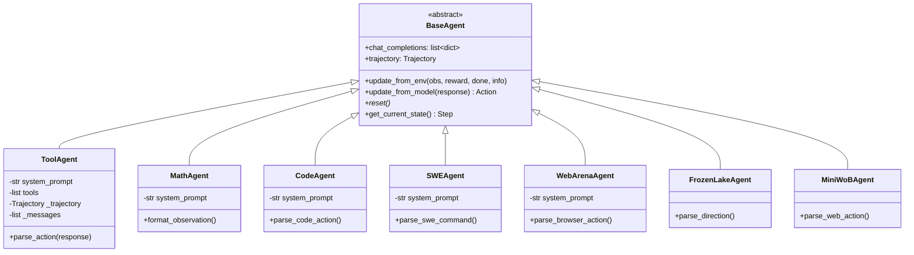

**AgentHub** (external agent integrations in `agenthub/`):

| Agent | Framework | Integration Mode |
|-------|-----------|-----------------|
| `react_agent` | Native rLLM | Agent/Env or Workflow |
| `langgraph_agent` | LangGraph | SDK Engine (LiteLLM Proxy) |
| `smolagents_agent` | SmolAgents | SDK Engine |
| `strands_agent` | Strands | SDK Engine |
| `swe_agent` | SWE-Agent | Agent/Env |
| `frozenlake_agent` | Classic RL | Agent/Env |
| `terminal_agent` | Terminal | Agent/Env |

### 3.2 BaseAgent Lifecycle — Sequence Diagram

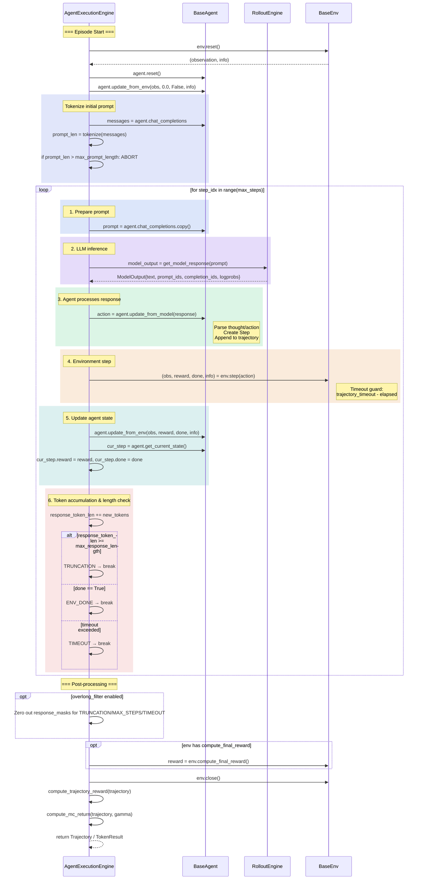

### 3.3 Rollout Backend Dispatch

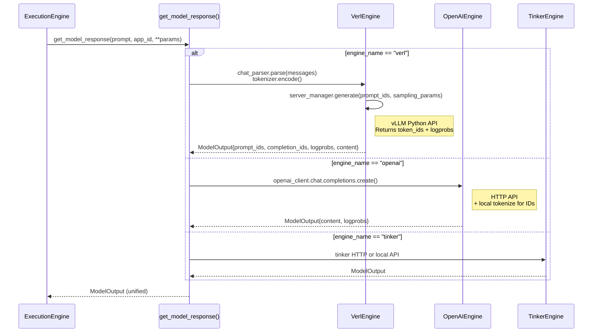

---

## 4. Execution Engine Comparison — Sequence Diagrams

### 4.1 AgentExecutionEngine (Agent-Env Loop)

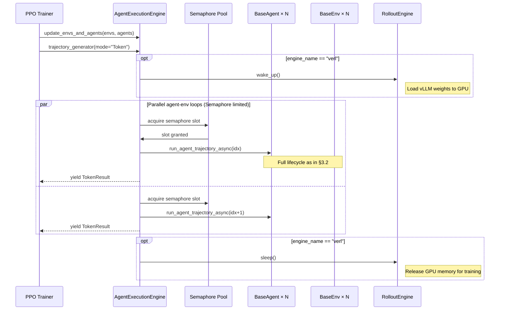

### 4.2 AgentWorkflowEngine (Custom Workflow)

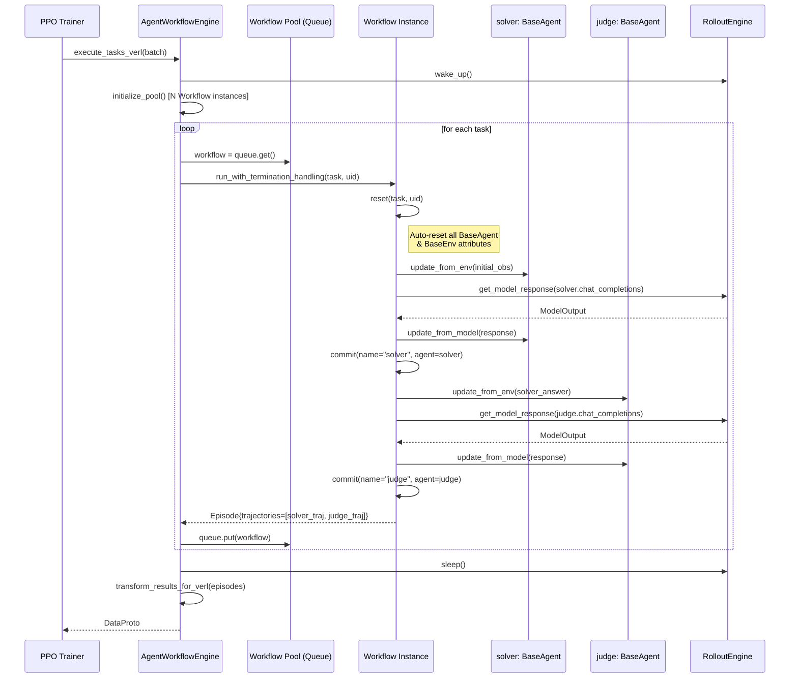

### 4.3 AgentSdkEngine (Framework-Agnostic)

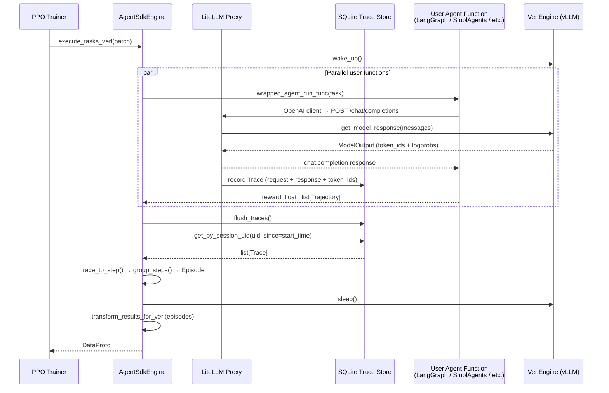

---

## 5. End-to-End Training Data Flow

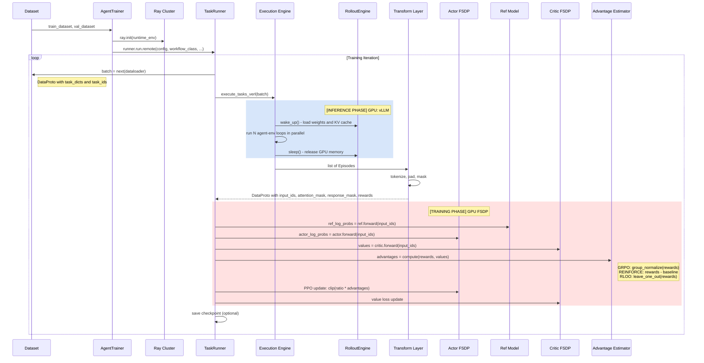

---

## 6. Workflow System — Structure & Variants

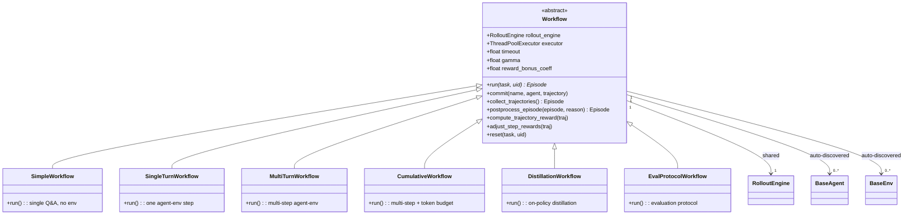

---

## 7. Backend Architecture & Selection

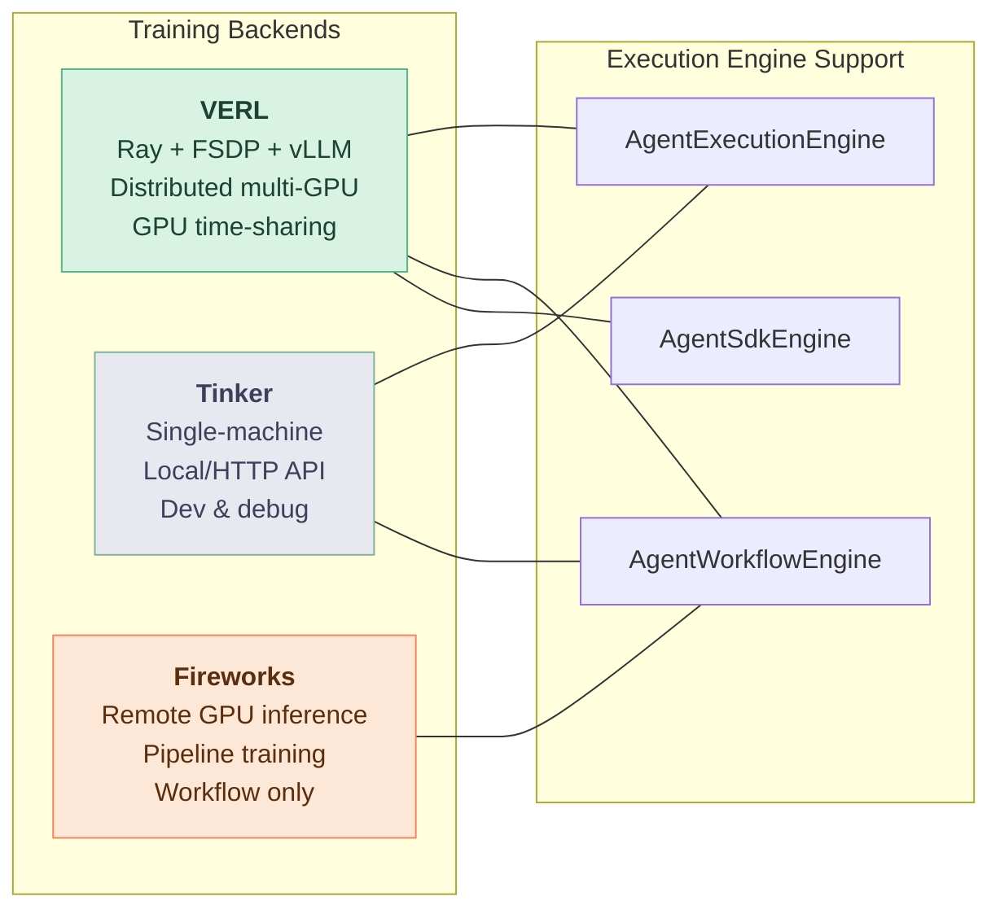

| Dimension | VERL | Tinker | Fireworks |
|-----------|------|--------|-----------|
| **Inference** | vLLM/SGLang Python API | Local/HTTP | Remote HTTP |
| **Training** | FSDP distributed | Single-GPU gradient | Pipeline remote |
| **GPU sharing** | ✅ wake_up/sleep | N/A | N/A |
| **Distributed** | ✅ Ray | ❌ | ❌ |
| **VLM support** | ✅ Qwen2VL/3VL | Partial | ❌ |
| **Agent/Env mode** | ✅ | ✅ | ❌ |
| **Workflow mode** | ✅ | ✅ | ✅ (only) |
| **SDK mode** | ✅ | ❌ | ❌ |
| **Best for** | Production training | Development/debug | Remote inference |

---

## 8. GPU Time-Sharing Mechanism (VERL Critical Path)

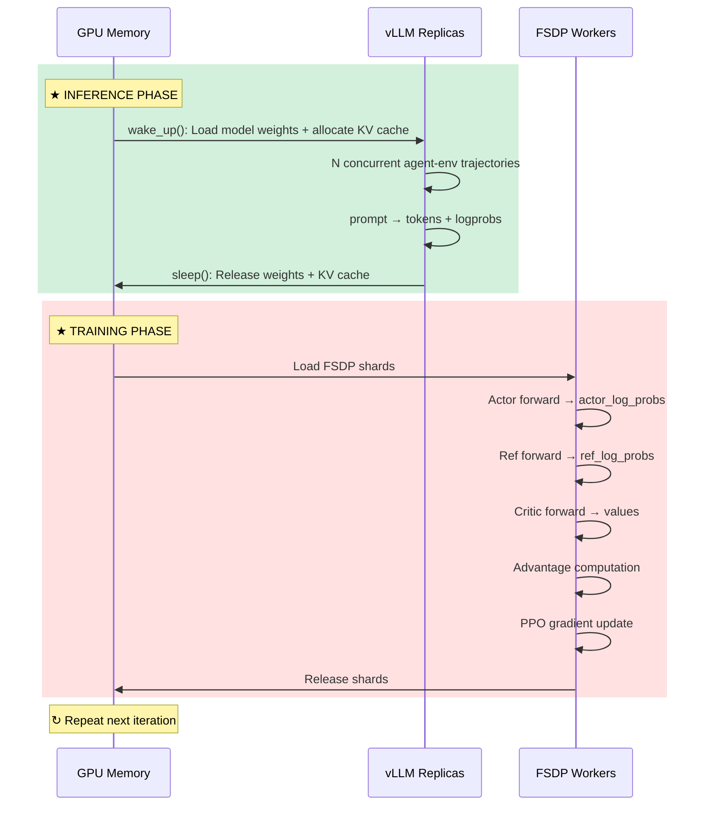

---

## 9. Component Ecological Niches — Interface & Role Reference

本节从五个核心组件的维度，分别梳理其 **主要功能**、**对外提供接口**（其他组件可调用它什么）、**对外访问接口**（它依赖哪些其他组件的接口）以及 **生态位**（在整体训练流水线中扮演的角色）。

---

### 9.1 ExecutionEngine（执行引擎）

**包含实现：** `AgentExecutionEngine` / `AgentWorkflowEngine` / `AgentSdkEngine`

#### 主要功能

- 批量并发地驱动 Agent ↔ Env 交互循环（或 Workflow / SDK 函数）。
- 管理并发度（`Semaphore` / `Queue`），限制同时活跃的轨迹数。
- 拼装多步对话 token（prompt + response 拼接、mask 标记），生成可供训练的 `TokenResult`。
- 负责 `RolloutEngine.wake_up()` / `sleep()` 的 GPU 时间片调度（仅 VERL backend）。
- 捕捉超时、截断、overlong 等异常情况并打标记。

#### 对外提供接口

| 接口 | 签名 | 调用方 |
|------|------|--------|
| `update_envs_and_agents` | `(envs, agents) → None` | Trainer（VERL PPO 轮次开始） |
| `trajectory_generator` | `async gen (mode) → TokenResult \| Trajectory` | Trainer（异步迭代获取轨迹） |
| `execute_tasks` | `async (tasks: list[dict]) → list[Trajectory]` | 独立评估 / Tinker backend |
| `execute_tasks_verl` | `(batch: DataProto) → DataProto` | AgentPPOTrainer（WorkflowEngine 版本） |
| `get_model_response` | `async (prompt, app_id, **kw) → ModelOutput` | 内部调用；Workflow 也可直接调用 |

#### 对外访问接口

| 依赖组件 | 调用的接口 |
|----------|-----------|
| `BaseAgent` | `reset()`, `update_from_env()`, `update_from_model()`, `get_current_state()`, `.chat_completions`, `.trajectory` |
| `BaseEnv` | `reset()`, `step(action)`, `close()`, `compute_final_reward()` (optional) |
| `RolloutEngine` | `get_model_response()`, `wake_up()`, `sleep()` |
| `transforms` | `transform_results_for_verl(episodes) → DataProto` |

#### 生态位

> ExecutionEngine 是 **数据生产者**。它处于 Dataset 与 Trainer 之间，将静态任务字典转化为含 token 序列、reward、response mask 的训练样本，是 agentic RL 区别于标准 RL 的核心基础设施。三种实现覆盖了"标准 Agent/Env 循环 → 自定义 Workflow → 第三方 SDK"三条路径，用户只需选择合适的一条插入自己的组件。

---

### 9.2 Agent（智能体）

**接口定义：** `BaseAgent`（`rllm/agents/agent.py`）

#### 主要功能

- 维护当前对话状态：`chat_completions`（消息列表）与 `trajectory`（步骤序列）。
- 接收环境观测并更新内部消息历史（`update_from_env`）。
- 解析模型文本响应，提取 thought/action 并写入最新 `Step`（`update_from_model`）。
- 在每个 episode 开始时清空状态（`reset`）。
- 通过 `get_current_state()` 向引擎暴露当前 `Step`，供写入 reward/done。

#### 对外提供接口

| 接口 | 签名 | 说明 |
|------|------|------|
| `reset()` | `→ None` | 清空对话历史与轨迹 |
| `update_from_env()` | `(obs, reward, done, info) → None` | 将环境反馈写入消息历史 |
| `update_from_model()` | `(response: str) → Action` | 解析响应，返回可执行 Action |
| `get_current_state()` | `→ Step \| None` | 返回轨迹最新 Step |
| `.chat_completions` | `→ list[dict]` | 当前完整对话消息（用于送入 LLM） |
| `.trajectory` | `→ Trajectory` | 所有已完成步骤的序列 |

#### 对外访问接口

Agent 本身 **不主动调用** 任何外部接口；它是纯被动的状态机，所有方法均由 ExecutionEngine 或 Workflow 驱动。

#### 生态位

> Agent 是 **状态持有者与解析器**。它封装了"如何把 LLM 文本转化为结构化动作"的领域逻辑，是唯一需要用户深度定制的组件。不同任务只需继承 `BaseAgent` 并覆写 `update_from_env` / `update_from_model`，其余训练基础设施完全复用。

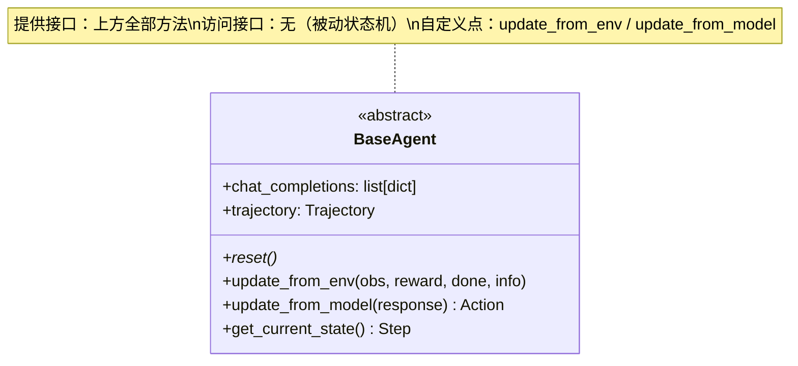

---

### 9.3 Trainer（训练器）

**主要实现：** `AgentTrainer`（`rllm/trainer/agent_trainer.py`）

#### 主要功能

- 统一用户入口：一行代码注册 `workflow_class` 或 `(agent_class, env_class)` 并绑定数据集与配置。
- 根据 `backend` 参数派发到正确的底层训练器（VERL / Tinker / Fireworks）。
- 对 VERL backend：初始化 Ray 集群，将 `TaskRunner` 作为 Ray Actor 远程运行迭代训练循环。
- 对 Tinker backend：本地调用 `TinkerAgentTrainer.fit_agent()` 做单机训练。
- 对 Fireworks backend：使用 `PipelineTaskRunner` 驱动远程推理 + 本地更新的流水线。

#### 对外提供接口

| 接口 | 签名 | 调用方 |
|------|------|--------|
| `__init__()` | `(workflow_class?, agent_class?, env_class?, config, dataset, backend)` | 用户训练脚本 |
| `train()` | `→ None` | 用户训练脚本 |

#### 对外访问接口

| 依赖组件 | 调用关系 |
|----------|---------|
| `ExecutionEngine` | 通过 `TaskRunner.run()` 间接创建并调用 `execute_tasks_verl()` / `trajectory_generator()` |
| `Dataset` | 取 `train_files` / `val_files` 路径注入到 config |
| `RolloutEngine` (verl) | 由底层 `AgentPPOTrainer` 持有，Trainer 不直接调用 |
| Ray | `ray.init()` + `runner.run.remote()` |

#### 生态位

> Trainer 是 **系统的顶层编排器**，也是用户的唯一交互入口。它对用户隐藏了 Ray、FSDP、vLLM 等的所有细节，只暴露"注册你的 Agent/Env/Workflow + 给我数据集 + 运行"这一层语义。同时它是多 backend 的统一门面，支持研究到生产的平滑迁移。

---

### 9.4 Env（环境）

**接口定义：** `BaseEnv`（`rllm/environments/base/base_env.py`）

#### 主要功能

- 实现标准 Gym 语义：`reset()` 返回初始观测，`step(action)` 返回 `(obs, reward, done, info)`。
- 提供工厂方法 `from_dict(info)` 支持从字典批量实例化（与 Dataset 的 task dict 解耦）。
- 通过 `is_multithread_safe()` 声明是否支持并发调用（AgentExecutionEngine 强制校验）。
- 可选实现 `compute_final_reward()` 延迟计算最终奖励（适合需要全局评判的任务）。

#### 对外提供接口

| 接口 | 签名 | 调用方 |
|------|------|--------|
| `reset()` | `→ (obs: dict, info: dict)` | ExecutionEngine（episode 开始） |
| `step(action)` | `→ (obs, reward: float, done: bool, info: dict)` | ExecutionEngine（每步） |
| `close()` | `→ None` | ExecutionEngine（episode 结束） |
| `compute_final_reward()` | `→ float`（可选） | ExecutionEngine（episode 结束后） |
| `from_dict(info)` | `(dict) → BaseEnv`（工厂） | ExecutionEngine.execute_tasks |
| `is_multithread_safe()` | `→ bool` | ExecutionEngine（初始化校验） |
| `.idx` | 属性 read/write | ExecutionEngine（tracking 用） |

#### 对外访问接口

Env 本身 **不调用** rLLM 框架的任何接口。它可以自由调用外部工具（代码沙箱、浏览器、数据库等），框架不约束其内部实现。

#### 生态位

> Env 是 **奖励信号的来源与任务状态机**。它定义了"什么是正确的动作、什么是任务完成"，是 RL 问题形式化的载体。框架对 Env 的唯一要求是遵守 Gym 接口，因此几乎任何外部环境（代码执行器、网页浏览器、数学验证器、游戏引擎）都可以包装为 `BaseEnv` 接入训练流程。

---

### 9.5 RolloutEngine（推理引擎）

**接口定义：** `RolloutEngine`（`rllm/engine/rollout/rollout_engine.py`）

#### 主要功能

- 提供统一的 LLM 推理接口，屏蔽底层推理服务差异（vLLM Python API / OpenAI HTTP / Tinker / Fireworks）。
- 返回标准化的 `ModelOutput`，包含文本内容、token IDs、per-token logprobs、reasoning 等训练所需全量信息。
- 通过 `wake_up()` / `sleep()` 配合 GPU 时间共享机制，在推理阶段与训练阶段之间切换 GPU 占用。
- 多实例并发安全（所有调用均通过 `async` 接口）。

#### 对外提供接口

| 接口 | 签名 | 调用方 |
|------|------|--------|
| `get_model_response()` | `async (messages: list[dict], **kw) → ModelOutput` | ExecutionEngine、Workflow |
| `wake_up()` | `async → None` | ExecutionEngine（推理阶段开始） |
| `sleep()` | `async → None` | ExecutionEngine（推理阶段结束） |

**`ModelOutput` 字段（调用方可访问）：**

| 字段 | 类型 | 说明 |
|------|------|------|
| `content` | `str` | 模型回复文本 |
| `reasoning` | `str` | 思维链内容（若有） |
| `prompt_ids` | `list[int]` | prompt token IDs |
| `completion_ids` | `list[int]` | 生成 token IDs |
| `logprobs` | `list[float]` | per-token log probabilities |
| `finish_reason` | `str` | 生成终止原因 |

#### 对外访问接口

| 依赖 | 说明 |
|------|------|
| `VerlEngine` → vLLM Server | Python API（`generate()`），需 `wake_up()` 加载权重 |
| `OpenAIEngine` → OpenAI HTTP | `openai.chat.completions.create()` |
| `TinkerEngine` → Local/HTTP | 本地推理或 Tinker HTTP API |
| `FireworksEngine` → Remote HTTP | Fireworks 远程推理 API |

#### 生态位

> RolloutEngine 是 **LLM 推理的统一抽象层**。它将 "向模型发一条消息" 这一操作与底层推理基础设施解耦，使 ExecutionEngine 和 Workflow 可以在不修改任何逻辑的情况下在 vLLM、OpenAI、远程 API 等之间切换。`wake_up/sleep` 是其独有的训练感知机制，让单 GPU 机器可以交替承担推理和训练两个阶段。

---

### 9.6 五组件交互总览

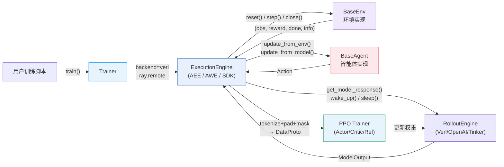

| 组件 | 生态位关键词 | 用户自定义点 |
|------|-------------|-------------|
| **Trainer** | 顶层编排器，统一入口 | 传入 class、config、dataset |
| **ExecutionEngine** | 数据生产者，并发编排 | 通常无需修改 |
| **Agent** | 状态持有者，响应解析器 | **必须继承定制** |
| **Env** | 奖励来源，任务状态机 | **必须继承定制** |
| **RolloutEngine** | LLM 推理抽象层 | 按 backend 选择，无需直接修改 |

---

## 10. AgentPPOTrainer 训练主循环详解

`AgentPPOTrainer` 继承自 verl 的 `RayPPOTrainer`，在 `fit_agent()` 中实现了完整的 Agentic RL 训练循环。

### 10.1 训练循环全貌

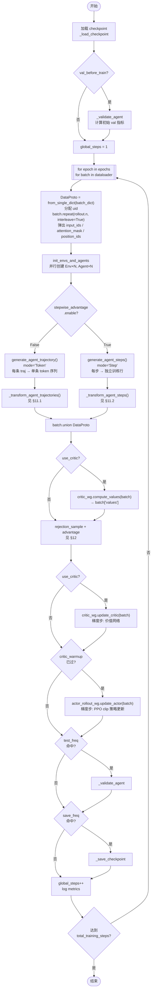

### 10.2 关键配置与对应行为

| 配置键 | 说明 | 影响 |
|--------|------|------|
| `rllm.stepwise_advantage.enable` | 是否逐步优势 | 决定 `generate_agent_trajectory` vs `generate_agent_steps` |
| `rllm.stepwise_advantage.mode` | `broadcast` / `per_step` | 影响 advantage 归一化分组 |
| `rllm.rejection_sample.enable` | 是否启用拒绝采样 | 过滤全对/全错 episode 组 |
| `rllm.agent.overlong_filter` | 超长过滤 | 截断/超时样本的 response_mask 全零化 |
| `rllm.mask_truncated_samples` | 截断样本掩码 | 过滤最后 token 仍有效的样本（未正常结束）|
| `actor_rollout_ref.rollout.n` | 每题 rollout 数 | 每条 task 生成 n 条轨迹，用于 GRPO 分组 |
| `trainer.critic_warmup` | Critic 预热步数 | 前 N 步只更新 Critic，稳定基线 |

---

## 11. 轨迹转换双路径详解

执行引擎按 `stepwise_advantage.enable` 走两条不同的转换路径，将原始交互数据打包为训练张量。

### 11.1 _transform_agent_trajectories（默认路径）

适用于 `stepwise_advantage.enable = False`，**每条轨迹 → 1 行 DataProto**。

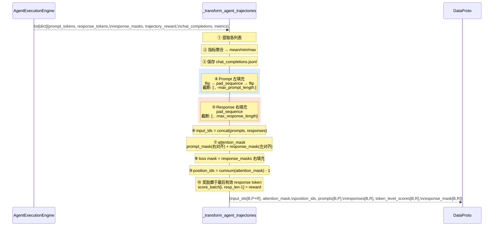

**关键设计**：
- Prompt **左填充** 使 prompt 末尾与 response 首字节相邻，保持因果注意力连续性
- 奖励置于最后 token 是 verl GRPO 的约定（`sum(scores, dim=-1)` 即标量奖励）
- `response_mask` 区分 LLM 生成 token（=1）与环境/用户 token（=0），仅对前者计算 loss

### 11.2 _transform_agent_steps（Stepwise 路径）

适用于 `stepwise_advantage.enable = True`，**每步 → 1 行 DataProto**。

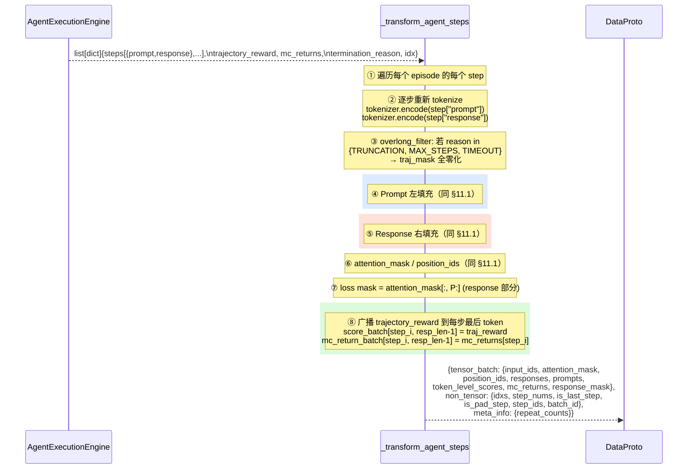

**两路径对比**：

| 维度 | `_transform_agent_trajectories` | `_transform_agent_steps` |
|------|-------------------------------|--------------------------|
| **DataProto 行粒度** | 1 trajectory → 1 行 | 1 step → 1 行 |
| **Tokenization** | 引擎直接提供 token IDs | 重新 `tokenizer.encode()` |
| **MC 回报** | ❌ 无 | ✅ `mc_returns[B, R]` |
| **逐步元数据** | ❌ 无 | ✅ `is_last_step`, `step_ids`, `repeat_counts` |
| **Overlong filter** | ❌（由引擎控制） | ✅ `response_mask` 全零化 |
| **适用算法** | GRPO/REINFORCE（整轨迹） | Stepwise GRPO / Credit Assignment |

---

## 12. Rejection Sampling & Advantage 计算

```mermaid
sequenceDiagram
    participant Batch as DataProto batch
    participant RS as Rejection Sampling
    participant Adv as compute_advantage()
    participant Actor as Actor Update

    Note over Batch: 获得 token_level_scores<br/>（来自环境奖励或 RM 模型）

    rect rgb(255, 235, 220)
        Note over RS: 按 uid 分组（同一任务 n 条 rollout）<br/>检测全对组 (all rewards >= 1): solve_all<br/>检测全错组 (all rewards <= 0): solve_none<br/>记录 partial 组数
    end

    alt rejection_sample.enable = True
        RS->>Batch: 过滤 valid_mask<br/>移除 solve_all + solve_none 的行
        Note over RS: 若过滤后 batch 为空 → skip 该批次
        Note over RS: 向下取整至 world_size 的倍数
    end

    rect rgb(220, 240, 255)
        Note over Batch: Actor forward: compute_log_prob<br/>→ old_log_probs, entropys
        Note over Batch: Ref forward: compute_ref_log_prob<br/>→ ref_log_probs（KL 约束用）
        Note over Batch: token_level_rewards = token_level_scores<br/>（注：KL penalty 以 loss 形式施加，非 reward 扣除）
    end

    alt stepwise_advantage.mode == "broadcast"
        Note over Batch: 分离 last_step 和 other_steps<br/>仅对 last_step 计算优势
        Batch->>Adv: compute_advantage(last_step_batch)
        Note over Adv: GRPO: 按 uid 分组,<br/>A_i = (r_i - mean) / std<br/>REINFORCE: A = r - baseline<br/>RLOO: leave_one_out
        Adv-->>Batch: advantages[last_step]
        Note over Batch: _stepwise_advantage_broadcast:<br/>将 last_step 的 advantage<br/>广播回同 uid 的所有步骤
        Note over Batch: concat(last_step + other_steps)
    else stepwise_advantage.mode == "per_step"
        Note over Batch: uid = step_ids（每步独立分组）<br/>token_level_rewards = mc_returns
        Batch->>Adv: compute_advantage(全步 batch)
        Adv-->>Batch: per-step advantages
    else stepwise_advantage disabled
        Batch->>Adv: compute_advantage(全 traj batch)
        Note over Adv: 标准 GRPO/REINFORCE/RLOO
        Adv-->>Batch: advantages[B]
    end

    Note over Actor: PPO clip update:<br/>ratio = exp(new_log_prob - old_log_prob)<br/>loss = -min(ratio*A, clip(ratio,1±ε)*A)<br/>KL penalty 直接作用于 policy loss
```

**Rejection Sampling 数值示例**（rollout.n=4）：

```
Task q1 的 4 条 rollout 奖励: [1.0, 1.0, 1.0, 1.0]  → solve_all → 丢弃
Task q2 的 4 条 rollout 奖励: [0.0, 0.0, 0.0, 0.0]  → solve_none → 丢弃
Task q3 的 4 条 rollout 奖励: [1.0, 0.0, 1.0, 0.0]  → partial → 保留
Task q4 的 4 条 rollout 奖励: [0.0, 1.0, 0.0, 1.0]  → partial → 保留

metrics:
  batch/solve_none   = 1
  batch/solve_all    = 1
  batch/solve_partial = 2
```

> **动机**：全对组的优势标准差为 0（GRPO 归一化后梯度为 0），全错组同理。保留这些样本只会浪费显存和计算，过滤后可提高单位计算量的信息量。

---

## 13. Stepwise Advantage 训练集成

### 13.1 broadcast 模式（推荐多步任务）

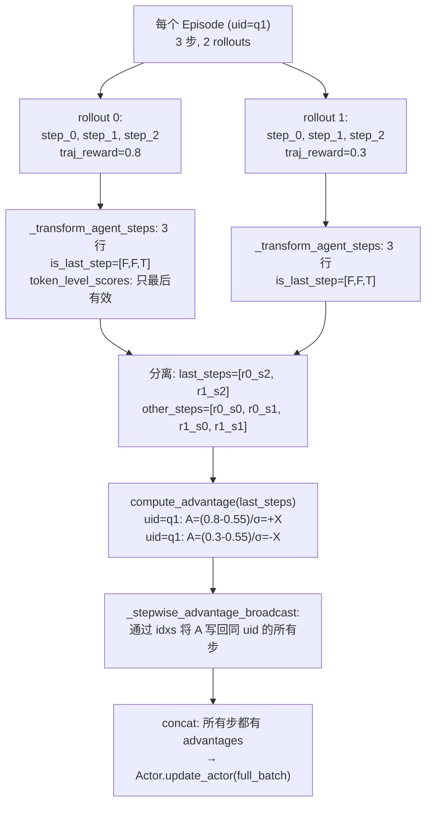

### 13.2 per_step 模式（细粒度信用分配）

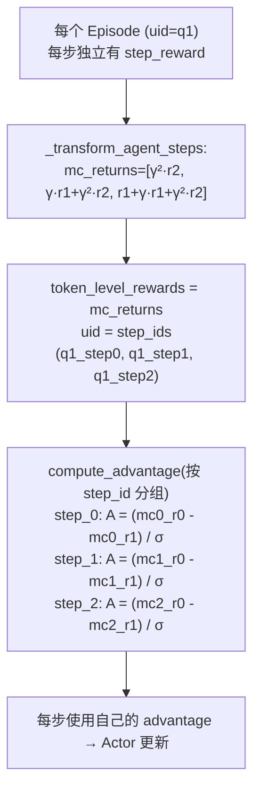

### 13.3 MC Return 计算

Monte Carlo 回报在引擎层（执行轨迹后）计算，写入每步 `Step.mc_return`：

```python
# compute_mc_return(trajectory, gamma)
# 从最后一步反向累积
mc_return = 0.0
for step in reversed(trajectory.steps):
    mc_return = step.reward + gamma * mc_return
    step.mc_return = mc_return
```

| 参数 | 说明 | 默认值 |
|------|------|--------|
| `gamma` | 折扣因子 | `1.0`（无折扣，适合稀疏奖励） |
| `step.reward` | 单步奖励（通常仅最后步非零） | 由环境 `step()` 返回 |
| `step.mc_return` | 从该步开始的期望累积回报 | 由 `compute_mc_return` 写入 |

---

## 14. 训练阶段完整数据形态

本节汇总每个训练阶段 DataProto 中关键张量的含义与形状（`B`=batch size, `P`=max_prompt_len, `R`=max_response_len）。

```mermaid
graph LR
    subgraph Rollout["推理阶段产出"]
        T1["input_ids [B, P+R]"]
        T2["attention_mask [B, P+R]"]
        T3["position_ids [B, P+R]"]
        T4["prompts [B, P]"]
        T5["responses [B, R]"]
        T6["token_level_scores [B, R]<br/>奖励仅最后有效token非零"]
        T7["response_mask [B, R]<br/>LLM生成token=1, 环境token=0"]
    end

    subgraph Critic["Critic 阶段添加"]
        T8["values [B, R]<br/>价值估计（GAE用）"]
    end

    subgraph LogProb["Log Prob 阶段添加"]
        T9["old_log_probs [B, R]<br/>rollout时的token对数概率"]
        T10["ref_log_probs [B, R]<br/>参考模型的对数概率（KL约束）"]
        T11["token_level_rewards [B, R]<br/>= token_level_scores"]
    end

    subgraph Adv["Advantage 阶段添加"]
        T12["advantages [B, R]<br/>GRPO/REINFORCE/RLOO归一化"]
    end

    subgraph PPO["PPO 更新使用"]
        T13["new_log_probs [B, R]<br/>当前actor的对数概率"]
        T14["ratio = exp(new-old) [B, R]"]
        T15["loss = -min(ratio·A,\nclip(ratio,1±ε)·A)"]
    end

    Rollout --> Critic --> LogProb --> Adv --> PPO
```

**Stepwise 模式额外张量**（仅 `stepwise_advantage.enable=True`）：

| 张量 | 形状 | 说明 |
|------|------|------|
| `mc_returns` | `[B, R]` | Monte Carlo 回报（最后有效token） |
| `is_last_step` | `[B]` (non-tensor) | 该行是否为 episode 的最后一步 |
| `step_ids` | `[B]` (non-tensor) | 步级 uid，格式 `{traj_uid}_step{i}` |
| `is_pad_step` | `[B]` (non-tensor) | 是否为填充 step（对齐 world_size） |
| `idxs` | `[B]` (non-tensor) | 对应原始 batch 的任务索引 |
| `repeat_counts` | `list[int]` (meta) | 每个 episode 展开的步数 |

---

## 15. `hybrid_engine` 配置项详解

### 15.1 含义

`actor_rollout_ref.hybrid_engine` 控制 **Actor（训练）与 Rollout（推理）是否共用同一个 Worker Group**。

```yaml
actor_rollout_ref:
  hybrid_engine: true   # 默认值，rllm 标准模式
```

| 值 | 说明 |
|----|------|
| `true`（混合引擎） | Actor 和 Rollout **合并**在同一个 `actor_rollout_wg` 中，共享 GPU 进程与显存 |
| `false`（分离引擎） | Actor 和 Rollout 分别运行在独立的 `actor_wg` + `rollout_wg` 中 |

### 15.2 各 Trainer 的强制约束

| Trainer | 强制要求 | 原因 |
|---------|---------|------|
| `AgentPPOTrainer` | 必须为 `true` | 依赖异步 Rollout，需混合引擎支持 |
| `AgentWorkflowTrainer` | 必须为 `true` | 同上 |
| `AgentPPOTrainerPipeline` | 必须为 `false` | Pipeline 模式下 Rollout 与 Actor 位于不同 Worker Group |
| `FullyAsyncTrainer` | 必须为 `false` | 全异步架构不支持混合引擎 |

代码位置：

```python
# agent_ppo_trainer.py L54
assert self.config.actor_rollout_ref.hybrid_engine, "Only hybrid engine is supported"

# agent_ppo_trainer_pipeline.py L23
assert not self.hybrid_engine, "PPO pipeline trainer does not support hybrid engine..."
```

### 15.3 对 Batch Padding 的影响

`_pad_dataproto_to_world_size` 根据此标志决定取哪个 Worker Group 的 `world_size` 计算对齐基数：

```python
if self.hybrid_engine:
    world_sizes.append(self.actor_rollout_wg.world_size)   # 合并的 wg
else:
    world_sizes.append(self.actor_wg.world_size)
    world_sizes.append(self.rollout_wg.world_size)
```

### 15.4 工程权衡

| 维度 | `hybrid_engine=true` | `hybrid_engine=false` |
|------|---------------------|----------------------|
| **GPU 利用** | 推理/训练共享显存，无权重传输 | 独立显存，需跨节点同步权重 |
| **延迟** | 低（同进程内切换） | 高（网络传输权重） |
| **规模** | 适合单机多 GPU | 适合超大规模流水线并行 |
| **rllm 支持** | ✅ 默认推荐 | 仅 Pipeline/FullyAsync 模式 |

> **结论**：rllm 的标准训练路径（`AgentPPOTrainer`）强制 `hybrid_engine=true`，即 Actor 训练与 Rollout 推理复用同一组 GPU Worker，无需跨节点传输权重，是 GPU 时间共享机制的基础。
