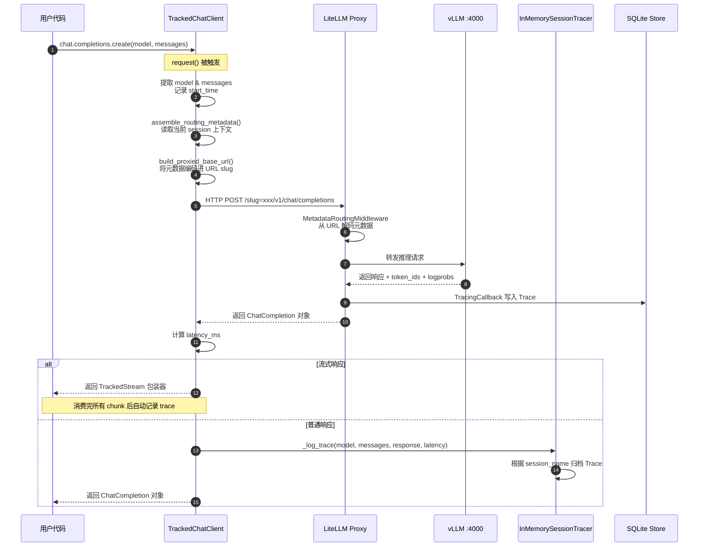

### 背景知识
OpenAI Input Payload：
```json
{
  "model": "gpt-4o",
  "messages": [
    { "role": "user", "content": "今天北京天气怎么样?" },
    {
      "role": "assistant",
      "content": null,
      "tool_calls": [{
        "id": "call_abc",
        "type": "function",
        "function": { "name": "get_weather", "arguments": "{\"city\":\"Beijing\"}" }
      }]
    },
    {
      "role": "tool",
      "tool_call_id": "call_abc",
      "content": "{\"temp\": 18, \"weather\": \"sunny\"}"
    }
  ],
  "tools": [{
    "type": "function",
    "function": {
      "name": "get_weather",
      "description": "Get weather for a city",
      "parameters": {
        "type": "object",
        "properties": { "city": { "type": "string" } },
        "required": ["city"]
      }
    }
  }]
}
```

OpenAI Output Payload的格式（非流式）；注意其中llm额外提供的字段
```json
{
  "id": "chatcmpl-abc123",
  "object": "chat.completion",
  "created": 1711000000,
  "model": "gpt-4o",
  "choices": [
    { // 正常回复
      "index": 0,
      "message": {
        "role": "assistant",
        "content": "Hello! How can I help you today?"
      },
      "finish_reason": "stop",
	  "provider_specific_fields": {
        "token_ids": [101, 2054, 2003, 1037, 30522, 102],        // !!! vllm 额外提供
		"response_logprobs": [0.0, -0.1, -0.2, -0.3, -0.4, -0.5] // 同上
	  },
      "logprobs": null
    },
    { // 工具调用不带回复
      "message": {
        "role": "assistant",
        "content": null,
        "tool_calls": [
          {
            "id": "call_abc123",
            "type": "function",
            "function": {
              "name": "get_weather",
              "arguments": "{\"location\": \"Beijing\"}"
            }
          }
        ]
      },
      "finish_reason": "tool_calls"
    }
  ],
  "usage": {
    "prompt_tokens": 10,
    "completion_tokens": 9,
    "total_tokens": 19
  },
  "system_fingerprint": "fp_abc123"
}
```

Payload格式（流式）
```json
data: {
  "id": "chatcmpl-abc123",
  "object": "chat.completion.chunk",
  "created": 1711000000,
  "model": "gpt-4o",
  "choices": [
    {
      "index": 0,
      "delta": {
        "role": "assistant",
        "content": "Hello"
      },
      "finish_reason": null
    }
  ]
}

data: {
  "choices": [{ "delta": { "content": "!" }, "finish_reason": null }]
}

data: {
  "choices": [{ "delta": {}, "finish_reason": "stop" }],
  "usage": { "prompt_tokens": 10, "completion_tokens": 9, "total_tokens": 19 }
}

data: [DONE]
```


入口：`examples/math_tool/train_math_with_tool.py`

train_math_with_tool

AgentTrainer.train函数
`_train_verl`函数
初始化ray：
`rllm/trainer/verl/ray_runtime_env.py`路径下包含了RAY的初始配置

TaskRunner(`rllm/trainer/verl/train_agent_ppo.py`)是一个Ray Actor.
```
class TaskRunner:
	def run(config):
		pass
```

- 从HDFS上拷贝`config.actor_rollout_ref` 参考策略到本地。
- 加载合适的训练框架的worker
- 加载奖励模型
- 加载对应Agent的Trainer
- `trainer.init_workers()`
- **`trainer.fit_agent()`**
- `trainer.shutdown()`

VeRL的worker架构是legacy了，有warning说架构调整会废弃。
`verl.workers.[fsdp_workers/megatron_workers]`

```
from verl.workers.fsdp_workers import ActorRolloutRefWorker, AsyncActorRolloutRefWorker, CriticWorker

from verl.workers.megatron_workers import ActorRolloutRefWorker, AsyncActorRolloutRefWorker, CriticWorker
```
- `AsyncActorRolloutRefWorker`
- `ActorRolloutRefWorker`
- `CriticWorker`

`trainer.init_workers()`
采样引擎，分为`openai`，`verl`，`tinker`.


`trainer.fit_agent()`
- 创建logger，加载checkpoint
- `_validate_agent()`


`trainer._validate_agent()`
- 使用`self.val_dataloader`采样`test_data`
- 异步创建环境 和 Agent，**环境以当前`batch`的数据作为初始化参数输入**。
	- 环境：`environments.tools.tool_env.ToolEnvironment(task=batch.extra_info, tools, tool_map, reward_fn)`。
	- Agent：`agents.tool_agent.ToolAgent(system_prompt, parser_name, tools, tool_map)`
		- `parser_name`是解析tool call的工具
- `trainer.generate_agent_trajectory`
	- 异步采样：`trainer.generate_agent_trajectories_async`
		- 建立一个异步函数，核心是调用`AgentExecutionEngine.trajectory_generator`
	- 转换为


### AgentExecutionEngine
#### run_agent_trajectory_async
输入：环境id与智能体id；
模式：`Text`、`Token`、`Conversation`、`Step`
  


### AgentSDKEngine
关键组件：
- `Session`，上下文，在上下文中的LLM请求都会被记录到sqlite中。
	- uid，用于标识一次上下文调用在数据库中的聚合关系，不用于训练时轨迹聚合
	- name，用于训练时轨迹聚合
- `Trace`，追踪器，是**单次 LLM 调用**的完整记录，一个Trace对应一个Step。
- `Step`：带有奖励（reward）的单次 LLM 调用
- `Trajectory`，拥有时间上的连续关系，是Step的有序排列。
- `Episode`，Engine的最终返回值；每一个Session对应一个Episode
	- 每一次用户函数调用会触发多条Trajectory对应一个Episode

>[!Notice]
>一个Trace可能对应多个Session。这在嵌套Session的场景会比较常见。

**Trace定义：**
```python
class Trace(BaseModel):
    trace_id: str                                      # 创建Trace对象时生成的uuid
    session_name: str
    name: str                                          # 格式: proxy/{model}
    input: LLMInput
    output: LLMOutput
    model: str                                         # model: 来自 output payload
    latency_ms: float                                  # 由 litellm 记录，来自 ModelResponse.response_ms
    tokens: dict[str, int] {prompt,completion,total}   # 记录prompt+answer 的 token **使用个数**
    metadata: dict = Field(default_factory=dict)       # !!! 来自客户端的透传数据，包含了session标记
    timestamp: float                                   # 创建Trace对象时的时间
    parent_trace_id: str | None = None
    cost: float | None = None
    environment: str | None = None
    tools: list[dict] | None = None
    contexts: list[str | dict] | None = None
    tags: list[str] | None = None
```

**Step定义：**
```python
class Step(BaseModel):
    model_config = ConfigDict(arbitrary_types_allowed=True, populate_by_name=True)
    id: str = Field(default_factory=lambda: str(uuid.uuid4()))                       # 和对应的trace对象相同的id
    input: Any | None = None
    output: Any | None = None
    action: Any | None = None
    reward: float = 0.0
    done: bool = False
    metadata: dict | None = None

def trace_to_step(trace: Trace) -> Step:
    messages = trace.input.messages
    response_message = trace.output.message
    assert response_message, "Response message is required in trace output"

    return Step(
        id=trace.trace_id,
        chat_completions=messages + [response_message],
        model_output=trace_to_model_output(trace),
        metadata=trace.metadata,
    )
```


>[! Important]
>Session拥有**uuid标识（全局唯一）**，**name标识（不唯一）**。
>一次用户函数执行一个Task，执行前会SDKEngine产生一个Session全局会话上下文，其uuid作为Sqlite聚合的标识。
>用户函数内如果创建子上下文，可以复用全局会话上下文的name，或者设置独立的name。
>全局name标识的格式为：`{task_id}:{rollout_idx}:{attempt_idx}`

#### 用户函数
可以是同步/异步函数。用户函数的关键作用：
- 调用LLM
- 提供轨迹的奖励值
- \*提供轨迹顺序（可选）
- \*提供轨迹采样metrics
```python
async def user_func(**task, ...):
	... 
	# 返回值是float | int | bool，则为奖励函数
	# 返回值为 [trajectory]，则为这条采样轨迹
	# 返回值是 ( Number|[trajectory], metrics)，第二项是 metrics 记录
```

#### 用户函数的调用链路
Engine会启动多个用户函数，
```
# 先经过一层session包装，保证用户函数在特定的上下文环境下执行
[sync/async] wrapped_agent_run_func <= wrap_with_session_context( [sync/async]user_func )

rollout时的调用链路
[sync] AgentSdkTrainer.generate_trajectories()
[async] execute_tasks_verl() -> [DataProto]
-> [async] execute_tasks() -> [Episode]
	# _execute_tasks中有一个执行一场则会反复重试
-> [async] _execute_tasks(tasks, task_ids) -> [Episode]
	# 返回结果按照给定的tasks顺序对应的Episode排列
	# 将多个task分发出去，收集结果
	# 会使用tqdm显示一个轨迹进度条
	# 从Sqlite中，根据 session_uid 读取Trajectory
-> [async] process_task_with_retry(task, task_id, rollout_idx, ...) -> task_id, rollout_idx, retry_attempt, output, session_uid
	# 尝试请求完成一条轨迹，并发控制+重试+异常处理
	# task_id 来源于 _execute_tasks 函数生成的uuid4
-> [async] _execute_with_exception_handling(task, task_id, rollout_idx, attempt_idx, ...) -> is_success, output, session_uid
	# 同步转异步，构造session_name
	# session_uid 是 session 创建时生成的uuid4, 格式: sess_xxxxxxxxxxxxxxxx
-> [sync/async] wrapped_agent_run_func(**task, ...)
```

#### 上下文管理

在函数 `_execute_with_exception_handling` 中会给出上下文变量的具体内容：
```
metadata = {
	"session_name": f"{task_id}:{rollout_idx}:{attempt_idx}",
	"task": task
}
```

经过包装函数 `wrap_with_session_context` 定义的包装后， 启用上下文管理器:
```
ContextVarSession(
	name = f"{task_id}:{rollout_idx}:{attempt_idx}",
	task = task
)
```

对于上下文对象类，重点关注一个成员变量，三个接口：
```python
class ContextVarSession:
	storage : SessionBuffer        # rllm/sdk/tracers/memory.py
	
	@property
	def llm_calls(self) -> list[Trace]:
		... '''返回一组 Trace 对象'''
	
	@property
	def steps(self) -> list[Step]:
		... '''将 Trace 对象转换为 Step 对象'''
	
	def clear_calls(self) -> None:
		...
```
这三个接口在rllm框架中没有用到，然而如果在用户定义的函数中，`ContextVarSession.llm_calls`可以用来跟踪一条调用链路（可用于标记Reward）。


#### Session ==注入/提取== 的调用链路
**运作逻辑：**
1. `AgentExecution` 阶段注入session到上下文；
2. 在请求LLM时，将Session信息通过 `ProxyClient` 注入到HTTP请求的URL slug。
	1. `ProxyClient` 将回复记录到Session的Buffer中，方便用户根据 trajectory 打标签
3. litellm代理收到请求，`MetadataRoutingMiddleware` 从 URL slug 中提取出 `meta_data`，转换为 `payload` 中的 `metadata` 字段，而后litellm将其转换为 `requester_metadata` 字段.。
	1. litellm 代理通过 `add_middleware` 的方式增加 `MetadataRoutingMiddleware`，`rllm/sdk/proxy/middleware.py`
	2. 基于定制的litellm server，`rllm/sdk/proxy/litellm_server.py`
4. `TracingCallback` 接受回复，将回复记录到SQLite中。
5. `SDKEngine` 通过 `session_uid` 和 `session_name` 聚合记录



```
class MetadataRoutingMiddleware(BaseHTTPMiddleware):
    """Extract metadata from URL slugs, rewrite path, and inject metadata into body."""

    async def dispatch(self, request: Request, call_next: Callable[[Request], Awaitable[Response]]) -> Response:
        metadata: dict[str, Any] = {}
```

**记录方式：**
1. 使用Python上下文工具
2. 使用OpenTelemetry分布式上下文工具

**【Session注入】openai客户端请求链路 `sdk/chat/openai.py`：**
```
AgentExecution注入上下文 
-> user_func用户函数请求一个ProxyTrackedChatClient，代替OpenAIClient
-> ProxyTrackedChatClient.request()
	# override 的 OpenAIClient.request()
-> ProxyTrackedChatClient.assemble_routing_metadata() -> ProxyTrackedChatClient.get_current_metadata() -> 上下文 meta_data
	# 读取当前Context上下文信息
++ ProxyTrackedChatClient.build_proxied_base_url()
	# meta_data编码为base64, 最终地址 http://xxx/meta/rllm:xxxxx/v1
-> MetadataRoutingMiddleware 将 slug 塞入payload中，经过litellm的处理，变为metadata字段中的一员。

请求:
{
	"model": xxx,
	"messages": [...]
	"metadata": {
		"requester_metadata": {
			"rllm_metadata": {...}
		}
	}
}
```

**【Session提取】litellm代理接收链路：**
```
litellm(配合SQLlite Tracer)，位于 litellm_server 的独立程序:
AgentSDKEngine请求 http://xxx/admin/reload
-> LiteLLMProxyRuntime.reload()
	重载代理配置，litellm.callbacks 增加 TracingCallback 回调, SamplingParametersCallback 回调
-> requester_metadata
-> TracingCallback.async_post_call_success_hook(request_data, model_response)
	# `litellm_callbacks.py` 取出 metadata 的session_name/session_uid
-> SqliteTracer.log_llm_call()
	# 构造trace对象
...
-> AgentSDKEngine请求 http://xxx/admin/flush-tacer
-> SQliteTracer 将所有缓存写入sqlite文件，确保读取一致

---

AgentSDKEngine通过读取Sqlite数据库完成数据交换
```

`TrackedChatClient` 与 `AsyncTrackedChatClient` 都是通过hack `request` 请求，注入session信息实现。其中异步相关的类 `AsyncTrackedChatClient` 是 openai 库中使用 `async` 异步请求 `AsyncOpenAI` 类的包装。
```
# 创建
rllm.sdk.shortcuts.get_chat_client() -> ProxyTrackedChatClient
rllm.sdk.shortcuts.get_chat_client_async() -> ProxyTrackedAsyncChatClient

# 使用

```
#### Sqlite数据库
相关类包括：
```python
class SqliteTracer:
	''' 将数据组成Trace对象，然后发到SqliteTraceStore进行记录 '''
	def log_llm_call(...):
		...
	def log_llm_call_sync(...):
		...

class SqliteTraceStore:
	'''  '''
	async def close(self):
		...
	async def store(...):
	...
	async def store_batch(...):
		...
	async def get(...):
		...
	async def query(...):
		...
	async def get_session_uids_for_trace(self, trace_id: str):
		...
	
```

表 `traces` 结构，用于 `get_by_session_uid`函数
```
id: str                          # 来源于SqliteTracer._create_trace_payload在创建trace时的uuid函数
data: json_str                   # trace对象的完整 pydantic dump
namespace: str
context_type: str
meta_data: json_str
created_at: float
updated_at: float
```

表 `trace_sessions` 结构
```
trace_id: str
session_uid: str
created_at: str
主键: (trace_id, session_uid)
外键: trace_id -> traces.id
```
### 工具
`verl.utils.tracking.Tracking`
日志记录，等同于logger

### Notice
1. 根据VeRL中的约定，奖励值在每条轨迹response的最后一个有效位置。see: `agent_ppo_trainer._transform_agent_trajectories()`

### 数据类型

#### 外部数据类型

`verl.DataProto`，是工具库`tensordict`的封装。
DataProto是VeRL框架中数据流转的关键变量。包含两个元素，以及提供数据：
```
batch: td.TensorDict
meta_info: Dict

---
concat()合并两个DataProto
make_iterator()创建一个PytorchDataset
select()从中选择一个subset
to()移动到设备
union()联合两个DataProto
```

### 外部依赖接口
#### `verl.RayPPOTrainer`
`actor_rollout_wg.compute_log_prob(batch)`
`actor_rollout_ref.actor.loss_agg_mode`

#### `verl.trainer.ppo.core_algos`


### 特性
#### `val_before_train`


#### `stepwise_advantage`
对应配置项：`config.rllm.stepwise_advantage.enable`
影响Rollout过程，AgentExecutionEngine的`generate_generator`。开启时对应`Step`模式，关闭时对应`Token`模式。

**Stepwise Advantage 两种子模式**
启用 `stepwise_advantage` 后，还有两种子策略：
- 【该模式已经弃用】`per_step`，每步用各自的 `mc_return` 作为 reward 独立更新，uid 替换为 `step_id`。
- `broadcast`，只用最后一步计算 advantage，再广播给同 trajectory 的所有步骤。broadcasst模式时，奖励位于response的最后一个token位置。


#### `hybrid_engine`

#### `use_kl_in_reward`
启用时，在`TaskRunner.run`中，加入一个同步版本的`ActorRolloutRefWorker`。

#### 奖励评估
`TaskRunner.run`: 加载奖励模型
```
reward_fn = load_reward_manager(config, tokenizer, num_examine=0, **config.reward_model.get("reward_kwargs", {}))

val_reward_fn = load_reward_manager(config, tokenizer, num_examine=1, **config.reward_model.get("reward_kwargs", {}))
```

#### Agent Rollout
`TaskRunner.run`函数中：
- `agent_run_func`参数，对应`AgentSdkTrainer`类的trainer
- `workflow_class` 参数，对应`AgentWorkflow`类的trainer
	- 匹配参数`workflow_args`
- 【默认】`AgentPPOTrainer`类的Trainer
	- 匹配参数`env_args`和`agent_args`
