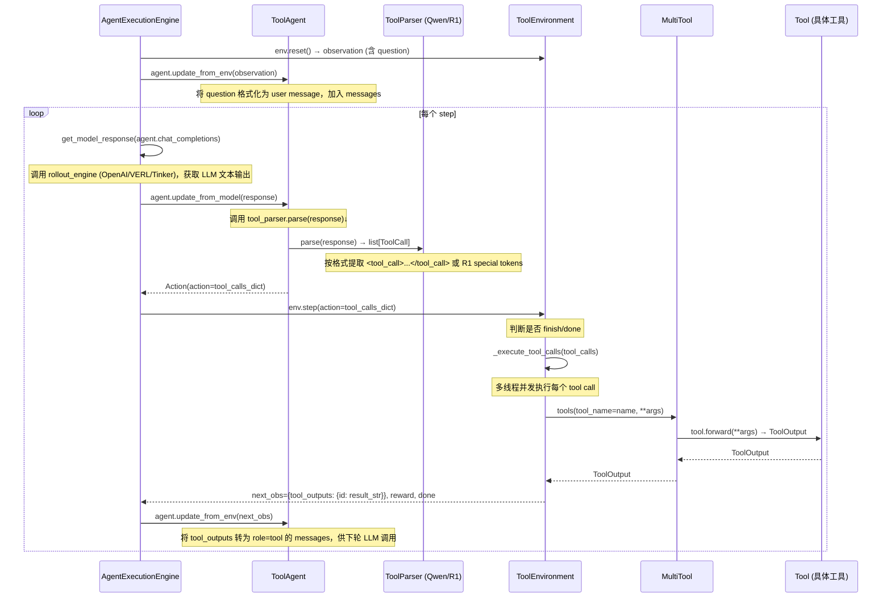

# rLLM 工具调用（Tool Calling）完整调用链

## 整体架构

工具调用涉及 **4 个核心层**：Parser → Agent → Env → Tool，由 `AgentExecutionEngine` 统一驱动。



---

## 关键环节代码定位

| 环节 | 文件 | 方法 | 说明 |
|------|------|------|------|
| **驱动循环** | `engine/agent_execution_engine.py` | `run_agent_trajectory_async()` L227-355 | 主 for loop，驱动 agent-env 交互 |
| **LLM 推理** | `engine/agent_execution_engine.py` | `get_model_response()` L133 | 路由到 OpenAI/VERL/Tinker 引擎 |
| **解析工具调用** | `parser/tool_parser.py` | `QwenToolParser.parse()` / `R1ToolParser.parse()` | 从 LLM 输出文本中提取 `<tool_call>` |
| **Agent 处理响应** | `agents/tool_agent.py` | `update_from_model()` L102 | 调用 parser，构建 tool_calls_dict，记录到 trajectory |
| **Env 执行工具** | `environments/tools/tool_env.py` | `step()` L55 + `_execute_tool_calls()` L111 | **工具实际执行的地方**，多线程并发调用 |
| **工具分发** | `tools/multi_tool.py` | `forward(tool_name, **kwargs)` L39 | 按名字找到具体 Tool 实例并调用 |
| **工具实现** | `tools/tool_base.py` | `Tool.forward()` L107 | 具体工具逻辑，用户通过继承此类实现 |
| **观测回写** | `agents/tool_agent.py` | `update_from_env()` L86 | 将 tool 结果包装成 `role=tool` 消息，注入 messages |

---

## 工具真正被调用的地方

**`tool_env.py` L111-142 的 `_execute_tool_calls()`** 是工具真正执行的地方：

```python
def execute_tool(tool_call):
    tool_name = tool_call["function"]["name"]
    tool_args = json.loads(tool_call["function"]["arguments"])
    tool_output = self.tools(tool_name=tool_name, **tool_args)  # → MultiTool.forward()
    tool_output_str = tool_output.to_string()
    output_queue.put((tool_call["id"], tool_output_str))
```

多个工具调用通过 **线程池并发执行**，结果以 `{tool_call_id: output_str}` 返回，最终在 `ToolAgent.update_from_env()` 中被转成 `role=tool` 消息回注给 LLM。

---

## ToolParser 与模型格式

| 模型系列 | Parser | LLM 输出格式 |
|----------|--------|--------------|
| Qwen / R2E | `QwenToolParser` | `<tool_call>{"name": ..., "arguments": ...}</tool_call>` |
| DeepSeek-R1 | `R1ToolParser` | `<｜tool▁call▁begin｜>function<｜tool▁sep｜>name\n` ` ```json\n{...}\n``` ` `<｜tool▁call▁end｜>` |

Parser 在 `ToolAgent.__init__()` 中按 `parser_name` 初始化，工具的 schema 通过 `get_tool_prompt()` 注入到 system prompt 中，告知 LLM 可用工具及其格式。
